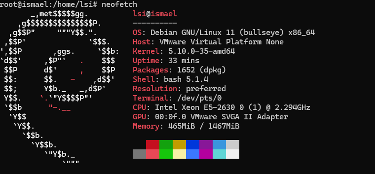

# PRÁCTICA 1 - Seguridad Informática

## Defensas en clase
- Traer papel y boli.  
- Revisar siempre todo lo que aparezca en pantalla.  
 - El viernes anterior a la semana de defensas se apagan las máquinas.  Antes de cerrar todo para la defensa hacer un poweroff de la máquina.
<br>

## Repaso COMANDOS BÁSICOS útiles para las prácticas
```bash
#Accesos
last               #Sesiones de usuarios accedidas a la máquina

# Navegación
pwd                 # Carpeta actual
ls                  # Listar
ls -l               # Listar con detalles
ls -a               # Incluir ocultos
cd /ruta            # Cambiar carpeta
cd ~                # Ir al home (~ es el directorio home del usuario actual)
cd ..               # Subir un nivel

# Archivos y directorios
touch archivo.txt   # Crear archivo vacío
mkdir carpeta       # Crear carpeta
mkdir -p a/b/c      # Crear subcarpetas
cp origen destino   # Copiar archivo
cp -r dir1 dir2     # Copiar directorio
mv origen destino   # Mover/renombrar
rm archivo.txt      # Borrar archivo
rm -r carpeta       # Borrar carpeta

# Ver contenido
cat archivo.txt     # Mostrar contenido
less archivo.txt    # Leer con paginador
head archivo.txt    # Primeras 10 líneas
tail archivo.txt    # Últimas 10 líneas
tail -f archivo.log # Ver en tiempo real

# Búsqueda
find . -name "archivo.txt"  # Buscar archivo
grep "texto" archivo.txt    # Buscar texto
grep -r "texto" /ruta       # Buscar en varios archivos

# Redirección y tuberías (pipes)
> sobreescribe el archivo
>> añade al final del archivo

| tubería. Envía la salida de un comando como entrada de otro comando, conectando procesos en serie

# Permisos
ls -l               # Ver permisos
chmod 755 archivo   # Cambiar permisos
chown usr:grp arch  # Cambiar propietario

# Procesos
ps               # Procesos ligados a tu terminal actual
   -e            # Muestra todos los procesos del sistema 
   -a            # Procesos de todos los usuarios (excepto los sin terminal)
   -u            # Procesos con info del usuario, CPU, memoria, etc.
   -x            # Incluye procesos sin terminal (daemons, servicios)
ps aux           # Vista clásica estilo BSD, muestra todos los procesos con detalles
ps -ef           # Vista estilo Unix System V, alternativa a aux

top                 # Procesos en tiempo real
kill PID            # Terminar proceso

# Paquetes (Debian/Ubuntu)
sudo apt update           # Actualizar lista
sudo apt upgrade          # Actualizar paquetes
sudo apt install paquete  # Instalar
sudo apt remove paquete   # Eliminar
dpkg -l | wc -l           # Lista todos los paquetes instalados  y wc -l cuenta las líneas, es decir, el total de paquetes.


# Red
ping 8.8.8.8         # Probar conexión
tracert ip           # Muestra el camino a seguir para alcanzar una IP

 **IP moderno**
ip a                         # Ver IP
ip addr show                 # Igual que ip a
ip addr add <IP>/<mask> dev <interfaz>   # Añadir dirección IP temporal
ip addr del <IP>/<mask> dev <interfaz>   # Quitar dirección IP
ip link show                 # Mostrar estado de interfaces
ip link set <interfaz> up    # Activar interfaz
ip link set <interfaz> down  # Desactivar interfaz
ip route show                # Mostrar tabla de rutas
ip route add <red> via <gateway> dev <interfaz>  # Añadir ruta
ip route del <red>           # Eliminar ruta

**ifconfig (antiguo)**
ifconfig                     # Mostrar interfaces activas
ifconfig <interfaz>          # Mostrar detalles de interfaz
ifconfig <interfaz> up       # Activar interfaz
ifconfig <interfaz> down     # Desactivar interfaz
ifconfig <interfaz> <IP> netmask <mask>  # Asignar IP temporal
ifconfig <interfaz>:<n> <IP> netmask <mask>  # Crear alias/interfaz lógica

**route (rutas)**
route -n                     # Mostrar tabla de rutas
route add default gw <gateway>        # Añadir puerta de enlace predeterminada
route del default gw <gateway>        # Eliminar puerta de enlace predeterminada
route add -net <red> gw <gateway>    # Añadir ruta específica
route del -net <red> gw <gateway>    # Eliminar ruta específica

**sockets**
1-Alternativa nueva
ss           # Muestra todos los sockets
   -t        # TCP
   -u        # UDP
   -l        # Solo sockets escuchando (listening)
   -n        # Mostrar IPs y puertos en números (no nombres)
   -p        # Mostrar PID y proceso que usa el socket
   -a        # Mostrar todos los sockets (escuchando y conectados)
   -s        # Resumen de conexiones por tipo

2-Alternativa clásica (más lento que ss, pero muy usada)
netstat
   -t        # TCP
   -u        # UDP
   -l        # Solo escuchando
   -n        # Números en lugar de nombres
   -p        # PID/Nombre del proceso
   -a        # Todas las conexiones y puertos escuchando
   -r        # Tabla de rutas
   -s        # Estadísticas de protocolos
   -i        # Interfaces de red

 
wget <url>                    # Descarga el contenido en un archivo con el mismo nombre que en el servidor.
wget -o <url>                 # Para verlo por pantalla ya que lo manda a stdout
wget --server-response --spider <url>  # Hace la petición y muestra únicamente los headers HTTP, sin guardar nada.
wget -q <url>                 # Descarga sin mostrar barras ni mensajes, solo errores.


curl <url>                   # Probar conexión HTTP/HTTPS y obtener contenido
curl -I <url>                # Solo encabezados HTTP
curl -s <url>                # Silencioso, sin mostrar progreso
curl -O <url>                # Descargar archivo
curl -L <url>                # Seguir redirecciones


# Usuarios
whoami               # Usuario actual
id                   # UID y grupos
adduser usuario      # Crear usuario
passwd usuario       # Cambiar contraseña

# Sistema
uname -r             # Versión kernel
lsb_release -a       # Versión distro
df -h                # Espacio en disco
du -sh carpeta       # Tamaño carpeta
free -h              # Memoria RAM
systemctl            # Gestiona el estado de los servicios del sistema
   - list-units → “lista las unidades que están activas ahora”
   - list-unit-files → “lista todas las unidades que existen y su configuración de inicio”
          ---type = service | target | socket | mount | device | timer | path | slice | automount | swap
          --state = active | inactive | enabled | disabled | masked | static
   - status <unidad> → “muestra el estado detallado de una unidad o servicio específico”
   - start <unidad> → “inicia un servicio/unidad”
   - stop <unidad> → “detiene un servicio/unidad”
   - restart <unidad> → “reinicia un servicio/unidad”
   - enable <unidad> → “configura la unidad para que arranque automáticamente”
   - disable <unidad> → “desactiva el arranque automático de la unidad”
   - get-default → “muestra el target por defecto del sistema”
   - set-default <target> → “cambia el target por defecto del sistema (permanente)”
   - isolate <target> → “cambia al target especificado inmediatamente (temporal)”
   - daemon-reload  →  e dice a systemd que recargue todas las unidades y servicios.
journalctl           # Muestra los registros (logs) de los servicios y del sistema
     -b → “muestra los logs desde el último arranque”
     -a → “muestra todas las líneas completas, incluso las truncadas por pantalla”
     -p err → Muestra solo los mensajes de error (y más graves) del sistema.
     -u <unidad> → “filtra los logs de una unidad o servicio específico”
     -f  → “muestra los logs en tiempo real (como tail -f)”
     --since "YYYY-MM-DD HH:MM:SS" → “muestra logs desde una fecha/hora específica”
     --until "YYYY-MM-DD HH:MM:SS" → “muestra logs hasta una fecha/hora específica”
uptime               # Tiempo encendido
reboot               # Reiniciar
shutdown now         # Apagar

# Flag de ayuda para ver comandos grandes de golpe
--no-pager
```


---
<br>

## Usuarios
- Usuario inicial:  
  - `lsi`  
  - IP: `10.11.48.74`  
  - Contraseña inicial usuario lsi: `virtual;..`  
  - Root: `root@debian`
  - - Contraseña inicial root: `virtual;..`  

- Usuario propio:  
  - `lsi2.3.4`  
  - IP: `10.11.48.202`  

- Usuario compañero:
  -  `lsi2.3.4`  
  - IP: `10.11.48.175`  


---
## Redes para la realización de las prácticas
- **Eduroam**: no permitido el tráfico a los puertos 80 y 443.  
- **UDCDocencia**: no permitido el tráfico al puerto 22.  
- **VPN**(recomendada):  
  - Se obtienen dos IPs:
    - Una IP de la red para conectarse a la máquina Debian. Esta IP puede cambiar porque la tabla de la VPN se va llenando.  
      **No usar una IP fija con los 4 octetos definidos.**  
    - Una IP propia de la máquina local.  
  - Ambas IPs son diferentes.
 

```bash
lsi@ismael:~$ last
lsi      pts/0        10.30.12.189     Wed Sep 17 20:30   still logged in
lsi      pts/0        10.20.37.81      Tue Sep 16 18:04 - 18:05  (00:00)
```

Aquí podemos ver que, aunque nuestra máquina tenga la IP 10.11.48.202, en last aparece otra IP diferente para la sesión. Esto ocurre porque last muestra la IP desde la que nos conectamos a la máquina, es decir, la del equipo origen (nuestro PC). Si desde PowerShell comprobamos la IP de nuestra interfaz de red (ifconfig) y a la vez consultamos last en la máquina Debian, veremos que ambas coinciden, confirmando que es la IP desde la que se inició la sesión.


**IP de los alumnos:** `10.11.48.0/23`  
- `/23` porque con `/24` no alcanzan las IPs para todos los alumnos, ya que solo habría 256 direcciones posibles con /24. Con /23 hay 512 direcciones IPs disponibles, suficientes para todos.
- `0` → IP de subred.  
- `1` → IP de gateway.  
- `255` → IP de broadcast.  

---
<br>

## Sistema Operativo
- Se comienza con **Debian 10**.  
- Actualizar sistema: 10 → 11 → 12.  
- Actualizar también el kernel a la versión correspondiente. 
- Una vez actualizado, eliminar ficheros de las versiones 10 y 11.  
- **No se puede saltar directamente de Debian 10 a 12.**  
- Revisar los servicios activos para asegurar que no queda nada corriendo que no corresponda.  

---
<br>


## Primeros pasos obligatorios

### 1.Conexión por SSH:  
```bash
ssh lsi@10.11.48.202
```

Al conectarse por primera vez, se pide aceptar la huella digital (fingerprint), que es un mensaje del siguiente estilo:
```bash
The authenticity of host '192.168.1.10 (192.168.1.10)' can't be established.
ECDSA key fingerprint is SHA256:xxxxxxxxxxxxxxxxxxxxxxxxxxxxxxxxxxx.
Are you sure you want to continue connecting (yes/no/[fingerprint])?
```
Ese mensaje habla del fingerprint (huella digital) del servidor al que te conectas.
Te lo explico fácil:

1-Cada servidor SSH tiene un par de claves (pública y privada).

    La clave privada la guarda el servidor y nunca se comparte.
    
    La clave pública se usa para identificar al servidor.

2-El fingerprint es una huella digital de esa clave pública.

    Es como el DNI de la máquina.
    
    Sirve para comprobar que realmente te estás conectando al servidor correcto y no a un impostor.

3-Primera vez que te conectas a un servidor:

    Tu cliente SSH aún no conoce esa clave.
    
    Te avisa y te muestra la huella (fingerprint).
    
    Tú decides si confiar o no. Si aceptas (yes), se guarda en el archivo ~/.ssh/known_hosts.

4-Próximas veces:

    SSH comparará la huella guardada con la que le presenta el servidor.
    
    Si coincide: todo bien.
    
    Si no coincide:  Peligro → puede significar que alguien intenta suplantar el servidor (ataque Man-in-the-Middle) o que el servidor fue reinstalado y cambió su clave.
    

POR TANTO, el fingerprint es el DNI de la máquina.

La primera vez lo guardas.

Después sirve para comprobar que siempre entras a la misma máquina y no a un impostor.    


Para comprobar esto, podemos acceder a otra powershell y poner lo siguiente:
```bash
type C:\Users\User\.ssh\known_hosts
```

Podemos observar que nos da algo asi:
```bash
10.11.48.202 ssh-ed25519 AAAAC3NzaC1lZDI1NTE5AAAAIKQfI1ZugU31gRpgEwcUi6oAokkz8EELqtseoFLN0DsV
10.11.482.202 ecdsa-sha2-nistp256 AAAAE2VjZHNhLXNoYTItbmlzdHAyNTYAAAAIbmlzdHAyNTYAAABBBG51QMMMvwsB+NAdwvHfhR1jQ+UrzZ6MBXlOr6ENTfWcFTJldY69HnGKsyz1xNlF6/YAwxwq4otq321jSaakjcE=
```
Eso significa que tu cliente ha aceptado dos tipos de claves del servidor:

  -Una clave ED25519
  
  -Una clave ECDSA

Esto es normal: el servidor Debian puede estar configurado con varios algoritmos de clave, y tu cliente guarda todos los que acepta.

Para comprobar que son de verdad de mi máquina debemos volver a la powershell de mi máquina y hacer lo siguiente:

```bash
root@debian:~# ssh-keygen -lf /etc/ssh/ssh_host_ed25519_key.pub
256 SHA256:Vergq/A8tdRdcdGu6VqvAo1LBIGEr1QN4FEudeG/R9g root@debian (ED25519)
root@debian:~# ssh-keygen -lf /etc/ssh/ssh_host_ecdsa_key.pub
256 SHA256:fBaTUZzR9oa1B2VWLwurmhlCaeRhpr5uloGtThsikF8 root@debian (ECDSA)
root@debian:~# ssh-keygen -lf /etc/ssh/ssh_host_rsa_key.pub
2048 SHA256:tPl0ZxJ3YTNBasMm4T13t74nrsR9nRXgHxE2+IGG69Y root@debian (RSA)
```


Ahora podemos comprobar estas mismas claves en nuestro windows:
```bash
ssh-keygen -lf C:\Users\User\.ssh\known_hosts
```

**Huellas en el servidor Debian:**

ED25519 → SHA256:Vergq/A8tdRdcdGu6VqvAo1LBIGEr1QN4FEudeG/R9g

ECDSA → SHA256:fBaTUZzR9oa1B2VWLwurmhlCaeRhpr5uloGtThsikF8

**Huellas en tu Windows (known_hosts):**

10.11.48.202 (ED25519) → SHA256:Vergq/A8tdRdcdGu6VqvAo1LBIGEr1QN4FEudeG/R9g ✅

10.11.48.202 (ECDSA) → SHA256:fBaTUZzR9oa1B2VWLwurmhlCaeRhpr5uloGtThsikF8 ✅


---
### 2-Cambiar las contraseñas de los usuarios y el hostname de la máquina
  -Cambiar la contraseña del usuario lsi.
  ```bash
  passwd
  ```
  -Cambiar la contraseña del usuario root.
  ```bash
su
passwd
```

**su: access to super user**

**passwd: change password**

### Diferencia entre `$` y `#`

- `$` → estás usando un usuario normal (ej. lsi).  
- `#` → estás usando el usuario root (administrador).  


-Cambiar el hostname de la máquina:
```bash
su
nano /etc/hostname

```
Actualizar el nombre, guardar y salir.
Reiniciar la máquina

```bash
su
reboot
```


### DIFERENCIAS ENTRE SU Y SU-

- **`su`**  
  Cambia de usuario (por defecto a root) pero **mantiene tu entorno actual**, incluyendo directorio y variables.
  ```bash
  lsi@ismael:~$ su
  Contraseña:
  root@ismael:/home/lsi#
  ```

- **`su -`**  
  Cambia de usuario **y carga el entorno completo** del nuevo usuario, incluyendo su PATH, variables y directorio inicial (`/root` si es root).
  ```bash
  lsi@ismael:~$ su -
  Contraseña:
  root@ismael:~#
  ```
  
---
### 3-Activar sudo   (NO ES RECOMENDABLE. AYUDA A COMETER ERRORES)
Activar sudo en Debian 10

Instala sudo (como root):
```bash
su -              # Entrar como root
apt update         # Actualizar lista de paquetes
apt install sudo   # Instalar sudo
```
Añadir nuestro usuario lsi al grupo sudo
```bash 
usermod -aG sudo lsi    # Permite a 'lsi' usar sudo
```

-aG:
  - G → indica “agregar al usuario a estos grupos”.

  - a → significa “añadir al grupo sin quitarlo de los demás grupos que ya tiene”.

Prueba sudo:
```bash
sudo whoami   
```

Debería mostrar root

### Diferencia entre `su` y `sudo`

- **`su -`**  
  Te loguea como root hasta que cierres sesión. Necesitas la **contraseña de root**.

- **`sudo`**  
  Ejecuta **un solo comando como root** usando tu contraseña de usuario normal.  
  No cambia tu usuario permanentemente, solo eleva privilegios para ese comando.  


---
### 4-Comprobar el número máximo de comandos permitidos en el historial (history) y ampliarlo
**El comando history es independiente para cada usuario, incluyendo root.**

El historial del root en mi máquina empieza a partir del comando 145

Cada usuario puede tener configuraciones distintas en ~/.bashrc o /etc/profile que afecten HISTSIZE y HISTFILESIZE:
- HISTSIZE -> número máximo de comandos que se guardan en la sesión actual.
- HISTFILESIZE -> número máximo de comandos que se guardan en el archivo de historial (\~/.bash_history).


Por tanto, lo primero que debemos hacer es comprobar cuandos comandos tenemos permitidos en ambos usuarios:

```bash
lsi@debian:~$ echo $HISTSIZE
1000
lsi@debian:~$ echo $HISTFILESIZE
2000
lsi@debian:~$ su -
Contraseña:
root@debian:~# echo $HISTSIZE
500
root@debian:~# echo $HISTFILESIZE
500
```

**echo**: muestra texto o variables en la terminal. Imprime texto o el contenido de ciertas variables ($variable) en la pantalla. 

Para aumentar ambos historiales tenemos que hacer lo siguiente:

- User normal:
```bash
echo "export HISTSIZE=1000000" >> ~/.bashrc
echo "export HISTFILESIZE=1000000" >> ~/.bashrc
source ~/.bashrc
```

- Root:
```bash
echo "export HISTSIZE=1000000" >> /root/.bashrc
echo "export HISTFILESIZE=1000000" >> /root/.bashrc
source /root/.bashrc
```
**source /root/.bashrc:** es un comando que le dice a tu shell actual que ejecute todas las instrucciones del archivo /root/.bashrc.

En otras palabras:

  - Normalmente, .bashrc se ejecuta cuando inicias sesión o abres una nueva terminal.
  
  - Con source, no necesitas cerrar ni abrir otra sesión, se aplican los cambios inmediatamente en la terminal actual.


<br>
<br>

---
# Puntos a resolver de la práctica 1

Familiarizarse con el **funcionamiento básico y la configuración de la máquina de laboratorio**, utilizando **comandos y ficheros de configuración en Linux**.  

La práctica finaliza con la **configuración básica de servicios de red**, realizada en grupos de dos alumnos.

---
### **Apartado A): Configure su máquina virtual de laboratorio con los datos proporcionados por el profesor. Analice los ficheros básicos de configuración (interfaces, hosts, resolv.conf, nsswitch.conf, sources.list,etc).**

Los pasos básicos explicados por el profesor ya los hemos realizado:
  - Conexión por SSH, entender y comprobar el correcto funcionamiento del fingerprint
  - Cambiar las contraseñas de los usuarios (lsi y root)
  - Instalar sudo
  - Ampliar el historial de comandos permitidos en ambos usuarios (lsi y root)

### **ANÁLISIS DE LOS FICHEROS BÁSICOS DE CONFIGURACIÓN (/etc - archivos de configuración del sistema)**

📂 /etc = Configuraciones del sistema y programas

Aquí casi todo son archivos de texto que puedes abrir y leer.
Son archivos de texto que contienen parámetros que definen cómo se comporta el sistema.

En Debian (y en Linux en general) casi todo se configura a través de archivos en /etc/. Es un directorio de configuración que contiene archivos y subcarpetas que configuran el sistema y los servicios.
#### 🔑 Configuración de usuarios y contraseñas:
- `/etc/passwd` → lista de usuarios del sistema, su ID, grupo, carpeta y shell, pero no contiene contraseñas reales. Ejemplo:
```bash
root:x:0:0:root:/root:/bin/bash     #nombre usuario, contraseña guardada en /etc/shadow, UID, GID, info del user, diretcorio del user, shell por defecto al iniciar sesión
```  
- `/etc/shadow` → USAR SUDO. Contraseñas cifradas de los usuarios. Ejemplo:
```bash
root:$6$FSEZLE5xfP.Xo3/M$Vd.VBf1s6M5fJWzeg8bHQxPHk75T3LBZjKGvyE4gRj0fNKVhnWHCfx2yO93NRPoAQsHMkFHS/AiJulnl3O/XC0:20345:0:99999:7:::
```
- `/etc/group` → grupos de usuarios y sus miembros.  Ejemplo:
```bash
sudo:x:27:lsi     #nombre grupo, contraseñas guardadas en /etc/shadow, GID, lista de miembros
```

#### 🌐 Configuración de red:
- `/etc/hosts` → tabla local de nombres (para resolver direcciones sin DNS).  
- `/etc/hostname` → el nombre del equipo -> debian (mi máquina) 
- `/etc/network/interfaces` (en Debian/Ubuntu viejos) → configuración de interfaces de red.  

#### ⚙️ Configuración de arranque y servicios:
- `/etc/fstab` → qué particiones montar al arrancar.  
- `/etc/systemd/` → scripts y configuraciones de servicios en sistemas modernos.  
- `/etc/init.d/` → scripts de inicio (sistemas más antiguos).  

#### 📦 Configuración de programas:
Cada aplicación suele tener su propia carpeta:  
- `/etc/ssh/sshd_config` → configuración del servidor SSH.  
- `/etc/apache2/` → configuración del servidor web Apache.  
- `/etc/mysql/` → configuración de MySQL.  

#### 📑 Otros ficheros útiles:
- `/etc/resolv.conf` → servidores DNS.  
- `/etc/sudoers` → quién puede usar `sudo`.  
- `/etc/crontab` → tareas programadas.  


### Ejemplos probados en la práctica:

**Para encontrar los ficheros que nos piden podemos usar:**
```bash
find [ruta] -name "patrón"
```
<br>

**etc/network/interfaces**

```bash
lsi@debian:~$ cat /etc/network/interfaces
# This file describes the network interfaces available on your system
# and how to activate them. For more information, see interfaces(5).
#source /etc/network/interfaces.d/*
# The loopback network interface
auto lo ens33
iface lo inet loopback
iface ens33 inet dhcp
```

Todo lo que lleve "#" son comentarios, no se ejeuctan.
Este archivo de configuracion le indica a mi máquina como usar sus cables y WIFI. No guarda la IP real ni lo que el ordenador está haciendo ahora, solo dice que hacer cuando arranca.

Lo que muestra mi salida es lo siguiente:

```bash
auto lo ens33
```

- Significa que estas dos interfaces (lo y ens33) se activan automáticamente al arrancar el sistema.

- “auto” = se enciende sola.

- lo = loopback, conexión interna de la máquina (no sale a Internet). La usa la máquina para hablar consigo misma.

- ens33 = cable de red o interfaz de red real.

```bash
iface lo inet loopback
```
- iface lo = esta configurando la interfaz lo
- inet = usamos el protocolo de red Ipv4
- loopback: tipo de conexión interna (la máquina habla consigo misma, no sale a Internet)

```bash
iface ens33 inet dhcp
```
- iface ens33 = esta configurando la interfaz de red real
- inet = usamos el protocolo de red Ipv4
- dhcp (dynamic host control protocol) = la IP se asigna automáticamente por el router.


En resumen:
1. lo → interna, siempre encendida, no sale a Internet.

2. ens33 → real, siempre encendida, obtiene IP automática para conectarse a la red.
<br>

**Añadir nuestra IP estática en ens33 y quitar el DHCP. Añadir también nuestra IP .50*

Hacemos esto para que mi máquina siempre tenga la misma IP. Evitamos que DHCP nos dé otra IP diferente cada vez que reiniciamos. Necesario si vamos a usar /etc/hosts para nombres, porque los alias dependen de IP fija. También vamos a añadir la interfaz ens34 con mi IP cambiando .48 por .50. Esto va a servir para que mi compañero pueda conectarse a mi máquina desde su propia máquina.

```bash
su -
nano /etc/network/interfaces
```

Cambiamos el contenido por:
```bash
# This file describes the network interfaces available on your system
# and how to activate them. For more information, see interfaces(5).
#source /etc/network/interfaces.d/*
# The loopback network interface
auto lo
iface lo inet loopback

# Primera interfaz
auto ens33
iface ens33 inet static
    address 10.11.48.202
    netmask 255.255.254.0
    gateway 10.11.48.1

# Segunda interfaz
auto ens34
iface ens34 inet static
    address 10.11.50.202
    netmask 255.255.254.0
```

**IMPORTANTE**:

Solo una interfaz puede tener gateway por defecto. Interfaces adicionales con IP en la misma red no necesitan gateway para que otros host se conecten.


Y ahora reiniciamos el servicio:
```bash
su -
systemctl restart networking
```

Si hay cualquier fallo en el restart de las interfaes podemos usar esto para ver dodne está el fallo:
```bash
systemctl status networking.service
```

Tener la configuración con IP estática en ens33  permite que la máquina siempre tenga las mismas direcciones IP, a diferencia de la configuración anterior con DHCP, donde la IP podía cambiar cada vez que se reiniciaba. Esto es útil para:

- Conectarse por SSH usando IP o alias en /etc/hosts sin preocuparse de que cambie la dirección.

- Mantener varias interfaces de red con subredes distintas, por ejemplo una para laboratorio y otra para acceso general.

- Garantizar estabilidad en la red y coordinación con compañeros o servicios que dependen de IP fija.

<br>

Para comprobar que todo funciona bien:
```bash
root@ismael:~# ip a
1: lo: <LOOPBACK,UP,LOWER_UP> mtu 65536 qdisc noqueue state UNKNOWN group default qlen 1000
    link/loopback 00:00:00:00:00:00 brd 00:00:00:00:00:00
    inet 127.0.0.1/8 scope host lo
       valid_lft forever preferred_lft forever
    inet6 ::1/128 scope host noprefixroute
       valid_lft forever preferred_lft forever
2: ens33: <BROADCAST,MULTICAST,UP,LOWER_UP> mtu 1500 qdisc fq_codel state UNKNOWN group default qlen 1000
    link/ether 00:50:56:97:9a:7f brd ff:ff:ff:ff:ff:ff
    altname enp2s1
    inet 10.11.48.202/23 brd 10.11.49.255 scope global ens33
       valid_lft forever preferred_lft forever
    inet6 fe80::250:56ff:fe97:9a7f/64 scope link
       valid_lft forever preferred_lft forever
3: ens34: <BROADCAST,MULTICAST,UP,LOWER_UP> mtu 1500 qdisc fq_codel state UNKNOWN group default qlen 1000
    link/ether 00:50:56:97:fa:74 brd ff:ff:ff:ff:ff:ff
    altname enp2s2
    inet 10.11.50.202/23 brd 10.11.51.255 scope global ens34
       valid_lft forever preferred_lft forever
```

 Ahí podemos ver que la interfaz ens33 está correctamente configurada con mi Ip estática y que está activa. 
 

Otra comprobación (ping al gateway y ambas ips configuradas):
```bash
root@ismael:~# ping 10.11.48.1
PING 10.11.48.1 (10.11.48.1) 56(84) bytes of data.
64 bytes from 10.11.48.1: icmp_seq=1 ttl=64 time=0.337 ms
64 bytes from 10.11.48.1: icmp_seq=2 ttl=64 time=0.351 ms
64 bytes from 10.11.48.1: icmp_seq=3 ttl=64 time=0.434 ms
64 bytes from 10.11.48.1: icmp_seq=4 ttl=64 time=0.375 ms
^C
--- 10.11.48.1 ping statistics ---
4 packets transmitted, 4 received, 0% packet loss, time 3039ms
rtt min/avg/max/mdev = 0.337/0.374/0.434/0.037 ms

root@ismael:~# ping 10.11.48.202
PING 10.11.48.202 (10.11.48.202) 56(84) bytes of data.
64 bytes from 10.11.48.202: icmp_seq=1 ttl=64 time=0.047 ms
64 bytes from 10.11.48.202: icmp_seq=2 ttl=64 time=0.052 ms
^C
--- 10.11.48.202 ping statistics ---
2 packets transmitted, 2 received, 0% packet loss, time 1017ms
rtt min/avg/max/mdev = 0.047/0.049/0.052/0.002 ms

root@ismael:~# ping 10.11.50.202
PING 10.11.50.202 (10.11.50.202) 56(84) bytes of data.
64 bytes from 10.11.50.202: icmp_seq=1 ttl=64 time=0.028 ms
64 bytes from 10.11.50.202: icmp_seq=2 ttl=64 time=0.053 ms
^C
--- 10.11.50.202 ping statistics ---
2 packets transmitted, 2 received, 0% packet loss, time 1029ms
rtt min/avg/max/mdev = 0.028/0.040/0.053/0.012 ms
```

#### CONCLUSIÓN:
- Tu IP estática 10.11.48.202 funciona correctamente.

- La segunda interfaz ens34 con IP 10.11.50.202 está correctamente configurada sin gateway, lo que permite que otros dispositivos de la red (por ejemplo, tu compañero) se conecten a tu máquina sin generar conflictos de rutas.

- La máquina puede comunicarse con el gateway.

- La interfaz ens33 y ens34 están activaa y listaa para usar SSH o otras conexiones de red.
---


**etc/hosts**

Es como una agenda de nombres de red para tu propio ordenador.
```bash
lsi@debian:~$ cat /etc/hosts
127.0.0.1       localhost
127.0.1.1       debian

# The following lines are desirable for IPv6 capable hosts
::1     localhost ip6-localhost ip6-loopback
ff02::1 ip6-allnodes
ff02::2 ip6-allrouters
```

Este archivo es una lista de nombres de computadoras y a qué dirección IP corresponden.
“Este nombre corresponde a esta dirección IP”.
Obtiene una relación entre un nombre de máquina y una dirección IP: en cada línea de /etc/hosts se especifica una dirección IP y los nombres de máquina que le corresponden, de forma que un usuario no tenga que recordar direcciones sino nombres de hosts. Habitualmente se suelen incluir las direcciones, nombres y alias de todos los equipos conectados a la red local, de forma que para comunicación dentro de la red no se tenga que recurrir a DNS a la hora de resolver un nombre de máquina.

```bash
127.0.0.1   localhost     #Cuando el sistema vea el nombre localhost, en realidad se conecta a 127.0.0.1 (tu propio PC).
127.0.1.1   debian        #También “yo mismo”, pero usando el nombre de la máquina (debian).
```

¿Y por qué no sale tu IP 10.11.48.202?

Porque 127.x.x.x no es tu IP real de la red, es una dirección especial solo para uso interno del ordenador.

La 10.11.48.202 sí es tu IP real en la red (la que usan otros equipos para conectarse a tu máquina).


#### RESUMEN FÁCIL:

127.0.0.1 y 127.0.1.1 = tu PC hablando consigo mismo.

10.11.48.202 = tu PC hablando con otros en la red.


Las últimas líneas que aparecen con comentario hacen referencia a IPv6:
```bash
::1     localhost ip6-localhost ip6-loopback
```
- ::1 = dirección IPv6 que apunta a tu propio PC (igual que 127.0.0.1 en IPv4).

- Nombres que se le pueden dar: localhost, ip6-localhost, ip6-loopback.

- Sirve para que tu máquina se pueda hablar a sí misma usando IPv6.


```bash
ff02::1 ip6-allnodes
```
- Dirección especial que significa “todos los dispositivos de la red local”.

- Se usa en redes IPv6 para enviar mensajes a todos los equipos a la vez.

```bash
ff02::2 ip6-allrouters
```
- Dirección especial que significa “todos los routers de la red”.

- Se usa en redes IPv6 para enviar mensajes a todos los routers a la vez.


#### RESUMEN FÁCIL:

- ::1 → tu PC hablando consigo mismo (IPv6).

- ff02::1 → enviar mensaje a todos los PCs de tu red.. Es como si enviaras un mensaje al aire y todos los PCs de tu red pudieran leerlo.

- ff02::2 → enviar mensaje a todos los routers de tu red. Sirve para enviar mensajes a los routers sin tener que escribir su IP exacta.


**Cambios en el archivo /etc/hosts**

En este archivo de configuración vamos a cambiar la IP 127.0.1.1 por nuestra IP. En este archivo de configuración se cambia la IP 127.0.1.1 por nuestra IP real para que el nombre de la máquina (hostname) se resuelva correctamente en la red local. Esto permite que la propia máquina se reconozca con su nombre usando su IP de red, que servicios como SSH, ping y otros programas funcionen sin problemas y que otros equipos puedan conectarse a ella utilizando un nombre en lugar de memorizar la dirección IP. En resumen, mejora la conectividad y evita conflictos de resolución de nombres dentro de la red.

Vamos a llamarle a nuestra Ip de dos formas: ismael y debian.

También vamos a añadir nuestra IP con .50 en vez de .48 que servirá para que nuestro compañero pueda conectarse a nuestra máquina debian desde la suya. A esta IP le llamaremos ismael-ssh
```bash
su -
nano /etc/hosts
```


Añadir:
```bash
  GNU nano 7.2                          /etc/hosts                                    127.0.0.1       localhost
10.11.48.202    ismael debian
10.11.50.202    ismael-ssh

# The following lines are desirable for IPv6 capable hosts
::1     localhost ip6-localhost ip6-loopback
ff02::1 ip6-allnodes
ff02::2 ip6-allrouters
```


- 10.11.48.202  ismael debian
   - Esto hace que tu máquina se pueda referir a sí misma como ismael o debian.

   - Opcional, no estrictamente necesario si ya estás dentro de tu máquina.
 
- 10.11.50.202  ismael-ssh
  - Esto permite que desde la máquina de mi comapañero pueda hacer ssh lsi@pc-compañero en vez de escribir la IP.
  - Utilidades:
     - SSH más fácil: ssh lsi@pc-compañero

     - Ping más legible: ping ismael-ssh

     - Copias de archivos más fáciles: scp archivo.txt lsi@lucas:/home/lsi/

     - Evitas memorizar IPs: si cambian las IPs, solo actualizas /etc/hosts.

<br>

Para comprobar que todo funciona bien:
```bash
root@ismael:~# ping -c 3 ismael
PING ismael (10.11.48.202) 56(84) bytes of data.
64 bytes from ismael (10.11.48.202): icmp_seq=1 ttl=64 time=0.028 ms
64 bytes from ismael (10.11.48.202): icmp_seq=2 ttl=64 time=0.051 ms
64 bytes from ismael (10.11.48.202): icmp_seq=3 ttl=64 time=0.049 ms

--- ismael ping statistics ---
3 packets transmitted, 3 received, 0% packet loss, time 2054ms
rtt min/avg/max/mdev = 0.028/0.042/0.051/0.010 ms
root@ismael:~# ping -c 3 debian
PING ismael (10.11.48.202) 56(84) bytes of data.
64 bytes from ismael (10.11.48.202): icmp_seq=1 ttl=64 time=0.032 ms
64 bytes from ismael (10.11.48.202): icmp_seq=2 ttl=64 time=0.051 ms
64 bytes from ismael (10.11.48.202): icmp_seq=3 ttl=64 time=0.049 ms

--- ismael ping statistics ---
3 packets transmitted, 3 received, 0% packet loss, time 2031ms
rtt min/avg/max/mdev = 0.032/0.044/0.051/0.008 ms
root@ismael:~# ping -c 3 ismael-ssh
PING ismael-ssh (10.11.50.202) 56(84) bytes of data.
64 bytes from ismael-ssh (10.11.50.202): icmp_seq=1 ttl=64 time=0.038 ms
64 bytes from ismael-ssh (10.11.50.202): icmp_seq=2 ttl=64 time=0.050 ms
64 bytes from ismael-ssh (10.11.50.202): icmp_seq=3 ttl=64 time=0.049 ms

--- ismael-ssh ping statistics ---
3 packets transmitted, 3 received, 0% packet loss, time 2044ms
rtt min/avg/max/mdev = 0.038/0.045/0.050/0.005 ms
```

---


 
**/etc/resolv.conf**:

Ponemos los servidores de nombres (DNS) que utilizará el equipo. El orden es importante, pues las consultas se envían al servidor de la primera línea nameserver, y si este fallara, se pasa al segundo y luego al tercero; por lo tanto, en primer lugar deberíamos poner siempre el servidor DNS más rápido.

```bash
lsi@debian:~$ cat /etc/resolv.conf
domain udc.pri
search udc.pri
nameserver 10.8.8.8
nameserver 10.8.8.9
```

Este archivo le dice a tu Debian cómo traducir nombres de páginas o máquinas a direcciones IP.

  - domain udc.pri → tu dominio local, básicamente “tu zona de red”

  - search udc.pri → si escribes un nombre corto de host, el sistema lo busca dentro de este dominio

  - nameserver 10.8.8.8 → primera dirección de servidor DNS que se usará para buscar nombres

  - nameserver 10.8.8.9 → segunda dirección de servidor DNS (respaldo)

En palabras fáciles: si escribes servidor1, tu Debian intenta buscarlo como servidor1.udc.pri usando primero el DNS 10.8.8.8 y si falla, prueba con 10.8.8.9.

Ejemplo:
```bash
ping servidor1
```
Qué pasa detrás de escena:

  1. Tu ordenador ve servidor1 y como no tiene IP directa, añade automáticamente el dominio de búsqueda: servidor1.udc.pri

  2. Luego pregunta al DNS 10.8.8.8: “¿Cuál es la IP de servidor1.udc.pri?”

  3. Si 10.8.8.8 no contesta, prueba 10.8.8.9

  4. El DNS responde algo como 10.8.8.50


Tu ordenador ahora hace ping 10.8.8.50 y puedes comunicarte con el servidor.

---


**/etc/nsswitch.conf**:

El archivo /etc/nsswitch.conf le dice a tu Debian dónde mirar primero y dónde después para encontrar cosas como usuarios, contraseñas o direcciones de otros ordenadores.

```bash
passwd:         files systemd        # Usuarios: primero archivos locales (/etc/passwd), luego systemd
group:          files systemd        # Grupos: primero archivos locales (/etc/group), luego systemd
shadow:         files                # Contraseñas cifradas: solo archivos locales (/etc/shadow)
gshadow:        files                # Contraseñas de grupos: solo archivos locales (/etc/gshadow)

hosts:          files mdns4_minimal [NOTFOUND=return] dns myhostname
                                    # Nombres de ordenadores: primero /etc/hosts, luego red local (mdns),
                                    # si no está [NOTFOUND=return], luego DNS y finalmente el nombre de la máquina
networks:       files                # Redes: busca en archivos locales (/etc/networks)

protocols:      db files             # Protocolos de red: primero base de datos, luego archivo (/etc/protocols)
services:       db files             # Servicios de red: primero base de datos, luego archivo (/etc/services)
ethers:         db files             # Direcciones MAC: primero base de datos, luego archivo (/etc/ethers)
rpc:            db files             # Servicios RPC: primero base de datos, luego archivo (/etc/rpc)

netgroup:       nis                  # Grupos de red: usa NIS (servicio de red)

```

Ahora, línea por línea:

- passwd: files systemd → para encontrar usuarios, primero mira los archivos locales (/etc/passwd) y después systemd

- group: files systemd → para encontrar grupos de usuarios, igual

- shadow: files → para las contraseñas cifradas, solo mira los archivos locales (/etc/shadow)

- hosts: files mdns4_minimal [NOTFOUND=return] dns myhostname

Para encontrar otros ordenadores por su nombre:
    
    - Mira tu archivo /etc/hosts (como tu agenda local)
    
    - Busca en la red local (mdns)
    
    - Si no hay, pregunta al DNS (como la guía telefónica de Internet)
    
    - Si es tu propia máquina, usa su nombre (myhostname)

Todo lo demás (networks, protocols, services…) → funciona igual: primero archivos locales, después servidores o bases de datos externas si hace falta


#### RESUMEN FÁCIL:

- nsswitch.conf = el orden que sigue tu Debian para buscar información.

- Primero mira archivos locales.

- Si no lo encuentra, pregunta a servicios de red o bases de datos.

Así siempre sabe dónde buscar y en qué orden.


### systemd = jefe del Linux que arranca y controla todos los servicios y tareas.
Sin él, tu Debian no sabría qué programas ejecutar al iniciar.

---


**/etc/apt/sources.list**:

Cada línea es el sitio donde se accede para descargar los paquetes necesarios.

```bash
lsi@debian:~$ cat /etc/apt/sources.list
#

# deb cdrom:[Debian GNU/Linux 10.4.0 _Buster_ - Official amd64 DVD Binary-1 20200509-10:26]/ buster contrib main

#deb cdrom:[Debian GNU/Linux 10.4.0 _Buster_ - Official amd64 DVD Binary-1 20200509-10:26]/ buster contrib main

deb http://deb.debian.org/debian/ buster main
deb-src http://deb.debian.org/debian/ buster main

deb http://security.debian.org/debian-security buster/updates main contrib
deb-src http://security.debian.org/debian-security buster/updates main contrib

# buster-updates, previously known as 'volatile'
deb http://deb.debian.org/debian/ buster-updates main contrib
deb-src http://deb.debian.org/debian/ buster-updates main contrib
```

El archivo /etc/apt/sources.list le dice a Debian de dónde puede descargar programas y actualizaciones. Cada línea indica un “repositorio”, que es un servidor con paquetes de software.

Las líneas que empiezan con # son comentarios, es decir, notas que el sistema ignora. Por ejemplo, las que hablan del DVD de instalación no se usan.

Las líneas que empiezan con deb indican paquetes listos para instalar (programas ya compilados).

Las líneas que empiezan con deb-src indican el código fuente de esos programas, que sirve si quieres compilar tú mismo el software.

Además, cada línea termina con main, contrib, etc.:

  - main → paquetes oficiales de Debian. Funcionan solos, no necesitan nada externo. Programas básicos como vim o bash.
  
  - contrib → paquetes extra que dependen de software libre adicional. Paquetes que son libres, pero necesitan algo fuera de Debian para funcionar. Es decir, el programa es libre, pero para usarlo necesitas software que no está en main.


#### **Con este archivo nos aseguramos de que partimos con una máquina Debian versión 10 (Buster)**

---


### **Apartado B) ¿Qué distro y versión tiene la máquina inicialmente entregada?. Actualice su máquina a la última versión estable disponible.**

Distro = versión completa de Linux lista para usar. En nuestro caso Debian, y ya sabemos ques la versión 10.

Kernel = es el núcleo del Sistema Operativo. Actúa como puente entre hardware y software. Todavía no sabemos su versión.


### Versión del distro
Según el source.list ya sabemos que estamos en un Debian 10. Esto se puede comprobar de varias maneras:

1-lsb_release -a (Linux Standard Base release)
Muestra información sobre nuestra distrubución de Linux.
```bash
lsi@debian:~$ lsb_release -a
No LSB modules are available.
Distributor ID: Debian
Description:    Debian GNU/Linux 10 (buster)
Release:        10
Codename:       buster
```

-a → significa all, es decir, “muestra toda la información disponible”.


2-cat /etc/*-release -> también nos da información sobre la versión.
```bash
lsi@debian:~$ cat /etc/*-release
PRETTY_NAME="Debian GNU/Linux 10 (buster)"
NAME="Debian GNU/Linux"
VERSION_ID="10"
VERSION="10 (buster)"
VERSION_CODENAME=buster
ID=debian
HOME_URL="https://www.debian.org/"
SUPPORT_URL="https://www.debian.org/support"
BUG_REPORT_URL="https://bugs.debian.org/"
```


3-/etc/debian_version
```bash
lsi@debian:~$ cat /etc/debian_version
10.4
```

### Versión del kernel

Varias formas de obtener la versión del kernel:

1. uname (Unix Name):
```bash
man uname
````

Parámetros:
-r	Muestra la versión del kernel

-a	Muestra toda la información disponible (kernel, hostname, arquitectura, fecha de compilación…)

-s	Muestra el nombre del sistema operativo

-m	Muestra la arquitectura de la máquina (amd64, i386…)

```bash
lsi@debian:~$ uname -r
4.19.0-9-amd64
```

```bash
lsi@debian:~$ uname -a
Linux debian 4.19.0-9-amd64 #1 SMP Debian 4.19.118-2+deb10u1 (2020-06-07) x86_64 GNU/Linux
```

### Herramienta para ver ambas con un comando: hostnamectl (preinstalada) y neofetch
```bash
root@ismael:~# hostnamectl
 Static hostname: ismael
       Icon name: computer-vm
         Chassis: vm 🖴
      Machine ID: db1c24869f59488fb51181a0eb0bcae8
         Boot ID: 415ae81d808841ed9fa9fce59ecde482
  Virtualization: vmware
Operating System: Debian GNU/Linux 12 (bookworm)
          Kernel: Linux 6.1.0-39-amd64
    Architecture: x86-64
 Hardware Vendor: VMware, Inc.
  Hardware Model: VMware Virtual Platform
Firmware Version: 6.00
```

```bash
sudo
apt install neofetch
```

```bash
neofetch
```



### Actualizar a Debian 11 (Buster -> BullSeye)

1. Ninguna actualización con update o upgrade va funcionar en Debian 10 ya que no está soportado oficialmente y los repositorios han sido movidos a archive.debian.org. apt intenta buscar archivos que ya no existen.

Por tanto, vamos a cambiar el contenido del archivo sources.list para poder actualizar los últimos paquetes de la versión 10.

```bash
sudo nano /etc/apt/sources.list

#

# deb cdrom:[Debian GNU/Linux 10.4.0 _Buster_ - Official amd64 DVD Binary-1 20200509-10:26]/ buster contrib main

#deb cdrom:[Debian GNU/Linux 10.4.0 _Buster_ - Official amd64 DVD Binary-1 20200509-10:26]/ buster contrib main

deb http://archive.debian.org/debian buster main contrib non-free
deb-src http://archive.debian.org/debian buster main contrib non-free

deb http://archive.debian.org/debian-security buster/updates main contrib non-free
deb-src http://archive.debian.org/debian-security buster/updates main contrib non-free

# buster-updates, previously known as 'volatile'
deb http://archive.debian.org/debian buster-updates main contrib non-free
deb-src http://archive.debian.org/debian buster-updates main contrib non-free
```
Guarda y cierra (Ctrl+O, Enter, Ctrl+X).

- main → Contiene software completamente libre, soportado oficialmente por Debian.

- contrib → Software libre, pero depende de paquetes que están en non-free. Por ejemplo, un programa libre que necesita un driver privativo para funcionar.

- non-free → Software propietario o con restricciones. Debian no puede garantizar soporte completo, pero a veces es necesario para que ciertos dispositivos o drivers funcionen (por ejemplo, controladores Wi-Fi, tarjetas gráficas, firmware).


2. Desactivar la comprobación de fechas expiradas

Los repositorios antiguos pueden dar error de “Release file expired”. Para solucionarlo, actualiza con:
```bash
sudo apt update -o Acquire::Check-Valid-Until=false
```


3. Ver qué se puede actualizar

Ya apt detectó paquetes actualizables. Confirma la lista:
```bash
apt list --upgradable
```

No actualiza nada. SOLO INFORMA


4. Actualizar todos los paquetes de Debian 10:

```bash
sudo apt upgrade -y
```

En upgrade nos pide actualizar el GRUB en el dev/sda (gestor de arranque que usa Debian (y casi todas las distros Linux)).

Tendré que marcar [*] con un espacion en dev/sda y darle a Aceptar moviendose con en Tabulador.


```bash
lsi@debian:~$ cat /etc/debian_version
10.13
```

Después de esto, haremos:

```bash
sudo apt full-upgrade -y
sudo apt autoremove -y
sudo apt autoclean
```

- update → actualiza la lista de paquetes

- upgrade → actualiza todos los paquetes que tengan nuevas versiones sin tocar dependencias que puedan romper algo

- full-upgrade → actualiza incluso paquetes que cambian dependencias 

- autoremove → elimina paquetes que ya no hacen falta ((viejos, huérfanos, dependencias obsoletas)

- autoclean → borra los paquetes .deb descargados que ya no sirven, liberando espacio.

- -y significa “sí automáticamente”, para no tener que confirmarlas una por una.


Ya tenemos el Debian 10 LIMPIO Y ACTUALIZADO.


Vamos a pasar ahora al 11:

Cambiamos el archivo de source.list de forma que quede tal que así:

```bash
lsi@debian:~$ sudo nano /etc/apt/sources.list
lsi@debian:~$ cat /etc/apt/sources.list
#

# deb cdrom:[Debian GNU/Linux 10.4.0 _Buster_ - Official amd64 DVD Binary-1 20200509-10:26]/ buster contrib main

#deb cdrom:[Debian GNU/Linux 10.4.0 _Buster_ - Official amd64 DVD Binary-1 20200509-10:26]/ buster contrib main

deb http://deb.debian.org/debian bullseye main contrib non-free
deb-src http://deb.debian.org/debian bullseye main contrib non-free

deb http://security.debian.org/debian-security bullseye-security main contrib non-free
deb-src http://security.debian.org/debian-security bullseye-security main contrib non-free

# buster-updates, previously known as 'volatile'
deb http://deb.debian.org/debian bullseye-updates main contrib non-free
deb-src http://deb.debian.org/debian bullseye-updates main contrib non-free
```


Ahora hacemos al igual que antes los siguientes pasos:
```bash
sudo apt update
sudo apt upgrade -y
sudo apt full-upgrade -y
sudo apt autoremove -y
sudo apt autoclean
```


## Problemas con las actualizaciones: se queda parada la instación por que se cierra el ssh

Si mientras estaba haciendo los comandos "sudo apt upgrade -y" o "sudo apt full-upgrade -y" se paró la actualización, debemos arreglar los paquetes.


**Cosas que hice**:

1. Matar procesos:
```bash
sudo kill -9 5900 5899
sudo kill -9 20607
```
- -9: Señal SIGKILL - la más fuerte, no se puede ignorar

- 5900 5899 20607: Números de identificación de los procesos (PID)


2. Eliminar archivos de bloqueo:
```bash
sudo rm /var/lib/dpkg/lock-frontend
sudo rm /var/lib/dpkg/lock  
sudo rm /var/cache/apt/archives/lock
```

3. Comprobar paquetes pendientes de instalación
```bash
sudo dpkg --configure -a
```
Este comando intenta configurar todos los paquetes que estén descargados pero no completamente configurados. No muestra una lista explícita, pero si hay errores, los verás en la salida.


4. Comprobar paquetes rotos o dependencias
```bash
sudo apt install -f
```
-f → significa fix broken

Por tanto este comando detecta paquetes con dependencias incompletas o conflictos e intenta repararlos automáticamente.


Ya por último hacemos una limpieza del sistema. 

Es recoendable usar --dry-run antes de hacer un autoremove para ver todos los paquetes que van a ser eliminados.
```bash
sudo apt autoremove --dry-run
```

Limpiar los paquetes viejos
```bash
apt autoremove -y
apt autoclean
```


### Actualizar a Debian 12 (BullSeye -> Bookworm)

Cambiar el sources.list:
```bash
#

# deb cdrom:[Debian GNU/Linux 10.4.0 _Buster_ - Official amd64 DVD Binary-1 20200509-10:26]/ buster contrib main

#deb cdrom:[Debian GNU/Linux 10.4.0 _Buster_ - Official amd64 DVD Binary-1 20200509-10:26]/ buster contrib main

deb https://deb.debian.org/debian bookworm main non-free-firmware
deb-src https://deb.debian.org/debian bookworm main non-free-firmware

deb https://security.debian.org/debian-security bookworm-security main non-free-firmware
deb-src https://security.debian.org/debian-security bookworm-security main non-free-firmware

# buster-updates, previously known as 'volatile'
deb https://deb.debian.org/debian bookworm-updates main non-free-firmware
deb-src https://deb.debian.org/debian bookworm-updates main non-free-firmware
```


```bash
sudo apt update           # Actualiza la lista de paquetes
sudo apt upgrade -y       # Actualiza paquetes sin eliminar nada. NO ES OBLIGATORIO. Podemos usar full-upgrade directamente
sudo apt full-upgrade -y  # Actualiza todo, incluso si requiere eliminar o reemplazar paquetes
sudo apt autoremove -y    # Limpia paquetes antiguos que ya no se usan
apt autoclean
```

Vamos a reiniciar la máquina para comprobar que está actualizado y sin problemas.
```bash
su
reboot
```


Ya tenemos todo instalado y limpio, pero no se me ha instalado la última versión del kernel del debian 12. Por tanto vamos a intentar actualizarla más:

```bash
sudo apt update
sudo apt install linux-image-amd64 linux-headers-amd64   #instala el kernel predeterminado de Debian 12 (paquete linux-image-amd64) y los headers del kernel (linux-headers-amd64) necesarios para compilar módulos o drivers si los necesitaras
sudo reboot
```


Ya por último vamos a borrar todo sobre los kernels 10 y 11 y dejar solo el 12:
```bash
lsi@ismael:~$ dpkg --list | grep linux-image
dpkg --list | grep linux-headers
rc  linux-image-4.19.0-27-amd64             4.19.316-1                          amd64        Linux 4.19 for 64-bit PCs (signed)
rc  linux-image-4.19.0-9-amd64              4.19.118-2+deb10u1                  amd64        Linux 4.19 for 64-bit PCs (signed)
ii  linux-image-5.10.0-35-amd64             5.10.237-1                          amd64        Linux 5.10 for 64-bit PCs (signed)
ii  linux-image-6.1.0-39-amd64              6.1.148-1                           amd64        Linux 6.1 for 64-bit PCs (signed)
ii  linux-image-amd64                       6.1.148-1                           amd64        Linux for 64-bit PCs (meta-package)
ii  linux-headers-6.1.0-39-amd64            6.1.148-1                           amd64        Header files for Linux 6.1.0-39-amd64
ii  linux-headers-6.1.0-39-common           6.1.148-1                           all          Common header files for Linux 6.1.0-39
ii  linux-headers-amd64                     6.1.148-1                           amd64        Header files for Linux amd6
```

Borrar kernels antiguos:
```bash
sudo apt purge -y linux-image-4.19.*-amd64 linux-image-5.10.*-amd64
sudo apt purge -y linux-headers-4.19.*-amd64 linux-headers-5.10.*-amd64
```

Limpiar paquetes huérfanos:
```bash
sudo apt autoremove --purge -y
sudo apt autoclean
```

```bash
lsi@ismael:~$ dpkg --list | grep linux-image
ii  linux-image-6.1.0-40-amd64            6.1.153-1                           amd64        Linux 6.1 for 64-bit PCs (signed)
ii  linux-image-amd64                     6.1.153-1                           amd64        Linux for 64-bit PCs (meta-package)
```

Ahora mismo solo tengo:

- linux-image-6.1.0-40-amd64 → el kernel actual (Debian 12 Bookworm).

- linux-image-amd64 → el meta-paquete que asegura que siempre reciba la última versión estable del kernel.


#### RESUMEN DE TODOS LOS COMANDOS UTILIZADOS PARA ACTUALIZAR DEBIAN:
```bash
# Repositorios
sudo nano /etc/apt/sources.list   # Editar repositorios a nueva versión

# Listas y actualizaciones
sudo apt update -o Acquire::Check-Valid-Until=false  # Actualizar lista ignorando fechas expiradas
apt list --upgradable                               # Ver paquetes actualizables
sudo apt upgrade -y                                 # Actualizar paquetes sin romper dependencias
sudo apt full-upgrade -y                            # Actualizar todo, incluso cambios de dependencias
sudo apt autoremove -y                              # Limpiar paquetes que ya no se usan
sudo apt autoclean                                  # Limpiar .deb descargados

# Problemas con bloqueos
ps -ef | grep apt                                  # Muestra si hay algún proceso relacionado con apt
    -e → muestra todos los procesos del sistema (no solo los tuyos).
    -f → usa formato "full", es decir, muestra más columnas con detalles (usuario, PID, PPID, hora, comando…).
sudo kill -9 PID                                    # Matar procesos colgados (apt/dpkg)
sudo rm /var/lib/dpkg/lock-frontend                 # Quitar lock de dpkg
sudo rm /var/lib/dpkg/lock
sudo rm /var/cache/apt/archives/lock

# Reparar paquetes
sudo dpkg --configure -a                             # Configurar paquetes pendientes
sudo apt install -f                                  # Arreglar dependencias rotas

# Kernel
sudo apt install linux-image-amd64 linux-headers-amd64  # Instalar kernel y headers de Debian 12
sudo reboot                                            # Reiniciar para aplicar cambios

# Información útil
uname -r          # Versión actual del kernel
lsb_release -a    # Información de la distro
neofetch          # Info completa de sistema y kernel (opcional)
```


dpkg hace la “operación cruda” sobre paquetes, apt hace lo mismo pero además busca dependencias y repositorios automáticamente.


---
### **Apartado C) Identifique la secuencia completa de arranque de una máquina basada en la distribución de referencia (desde la pulsación del botón de arranque hasta la pantalla de login). ¿Qué target por defecto tiene su máquina?. ¿Cómo podría cambiar el target de arranque?. ¿Qué targets tiene su sistema y en qué estado se encuentran?. ¿Y los services?. Obtenga la relación de servicios de su sistema y su estado. ¿Qué otro tipo de unidades existen?. Configure el sudo de su máquina.**

Lo primero de todo (ya lo hemos hecho, pero por si no está hecho aún), vamos a configurar sudo:
```bash
su -
apt install sudo
usermod -aG sudo lsi
```


Breve resumen de la secuencia de arranque:
La secuencia completa sería algo así:

  1. Encender máquina → BIOS/UEFI hace comprobaciones.
  
  2. MBR/GRUB → carga el kernel.
  
  3. Kernel arranca → aquí es cuando puedes ver mensajes con dmesg.
  
  4. Systemd (pid 1) toma el control → aquí es cuando puedes ver todo con journalctl -b.
  
  5. Se levantan servicios (red, login, etc.) → también registrado en journalctl -b.

  6. Llegas a la pantalla de login.


#### Cómo verlo en Linux

- dmesg → mensajes del kernel desde el arranque.

- journalctl -b → todo lo que hizo systemd durante este arranque.

- systemd-analyze → cuánto tardó cada parte del arranque.  

- systemctl list-dependencies default.target  →  Lista todas las units (servicios y targets) que dependen del target por defecto, es decir, todo lo que se inicia automáticamente cuando arranca tu máquina.


TODO ESTO HACERLO DENTRO DEL USUARIO ROOT!!

<br>

**mesg (display message o diagnostic message)**:

Muestra los mensajes que el kernel va escribiendo desde que se arranca la máquina.

Ejemplos de mensajes que muestra:

      Memoria detectada
            
      CPU detectada
            
      Discos y particiones
            
      Tarjetas de red
            
      Errores de hardware o drivers

```bash
dmesg
```

Otra forma de verlo paso por paso en vez de ver toda la salida de golpe:
```bash
dmesg | less
```
 - | → Esto le pasa la salida del comando dmesg al siguiente comando que es less
 - less → es un visor de texto en Linux. Permite ver archivos o salidas de comandos de forma paginada, sin que todo salga de golpe en la pantalla. A diferencia de cat,que muestra todo y se va al final, less te deja moverte arriba y abajo para leer con calma.

Para salir de less, presiona q.

<br>


**journalctl -b**

Herramienta para leer los logs del último arranque de systemd (que es el sistema de inicio moderno de Debian, Ubuntu, Fedora, etc.)

La opción -b significa "desde el arranque actual".

Te muestra todo lo que hizo systemd (y los servicios que maneja) desde que encendiste la máquina hasta ahora.

```bash
journalctl -b
```

<br>


**systemd-analyze**   -> Tiempo de botado de kernel (**APARTADO D**)

Mide cuánto tarda cada parte del arranque de tu sistema. Te da un resumen de kernel + userspace (espacio de usuario).

- Kernel time → tiempo que tardó el kernel en inicializar hardware y preparar el sistema de archivos raíz (/).

- Userspace time → tiempo que tardó systemd en iniciar todos los servicios hasta que el sistema está listo (login gráfico o multiusuario).


```bash
root@ismael:/home/lsi# systemd-analyze
Startup finished in 16.086s (kernel) + 1min 45.089s (userspace) = 2min 1.176s
graphical.target reached after 1min 45.050s in userspace.
```

16.086s (kernel) → el kernel tardó 16 segundos en inicializar el hardware y montar el sistema de archivos.

1min 45.089s (userspace) → systemd y todos los servicios tardaron 1 minuto 45 segundos en iniciarse.

2min 1.176s → tiempo total desde que encendiste la máquina hasta que el sistema está listo.

graphical.target reached after 1min 45.050s → la interfaz gráfica (login) estuvo lista justo después de los 1:45 min de userspace.

En resumen: el kernel arranca rápido, lo que más tarda son los servicios del sistema y la interfaz gráfica.


```bash
systemd-analyze blame
```
Este comando muestra los servicios que se iniciaron durante el arranque, ordenados por el tiempo que tardó cada uno en arrancar.

Sirve para identificar qué servicios ralentizan el inicio de tu sistema.

<br>

**systemctl list-dependencies default.target**
Lista todas las units (servicios y targets) que dependen del target por defecto, es decir, todo lo que se inicia automáticamente cuando arranca tu máquina.
```bash
root@ismael:/home/lsi# systemctl list-dependencies default.target
default.target
○ ├─anacron.service
● ├─avahi-daemon.service
● ├─console-setup.service
● ├─cron.service
● ├─cups-browsed.service
● ├─cups.path
● ├─cups.service
● ├─dbus.service
○ ├─e2scrub_reap.service
● ├─ModemManager.service
● ├─networking.service
● ├─NetworkManager.service
● ├─open-vm-tools.service
● ├─plymouth-quit-wait.service
● ├─plymouth-quit.service
● ├─pulseaudio-enable-autospawn.service
● ├─rsyslog.service
● ├─run-vmblock\x2dfuse.mount
○ ├─ssa.service
● ├─ssh.service
● ├─systemd-ask-password-wall.path
● ├─systemd-logind.service
○ ├─systemd-update-utmp-runlevel.service
● ├─systemd-user-sessions.service
○ ├─tpm2-abrmd.service
○ ├─unattended-upgrades.service
● ├─wpa_supplicant.service
● ├─basic.target
● │ ├─-.mount
● │ ├─low-memory-monitor.service
○ │ ├─tmp.mount
● │ ├─paths.target
● │ ├─slices.target
● │ │ ├─-.slice
● │ │ └─system.slice
● │ ├─sockets.target
● │ │ ├─avahi-daemon.socket
● │ │ ├─cups.socket
● │ │ ├─dbus.socket
● │ │ ├─systemd-initctl.socket
● │ │ ├─systemd-journald-audit.socket
● │ │ ├─systemd-journald-dev-log.socket
● │ │ ├─systemd-journald.socket
● │ │ ├─systemd-udevd-control.socket
● │ │ └─systemd-udevd-kernel.socket
● │ ├─sysinit.target
● │ │ ├─apparmor.service
● │ │ ├─dev-hugepages.mount
● │ │ ├─dev-mqueue.mount
● │ │ ├─keyboard-setup.service
```

Interpretación rápida

- ○ → unit cargada pero inactiva.

- ● → unit activa (está corriendo ahora).

- ├─ y │ → representan la jerarquía o dependencias entre unidades.

<br>
<br>

###  💳 Target 

Un target es como un “objetivo de arranque” del sistema. Le dice a Linux qué servicios y programas debe iniciar cuando enciendes el ordenador. Es como elegir un “modo de arranque”: con pantalla, sin pantalla, modo recuperación

Piensa en tu ordenador como si fuera un coche. Cuando enciendes el coche, puedes arrancar de diferentes maneras:

  - Modo normal → arranca todo (motor, luces, radio…).
  
  - Modo ahorro → solo arranca lo básico (motor y luces).
  
  - Modo mantenimiento → solo algunas cosas para revisar fallos.


**Target por defecto: systemctl get-default**

Es el target que Linux usa automáticamente al encender.

Existen distintos tipos de target en los sistemas Linux. Los más básicos son:

- Escritorio e interfaz gráfica→ graphical.target

- Modo multiusuario sin GUI, incluye red y servicios básicos → multi-user.target

```bash
root@ismael:/home/lsi# systemctl get-default
graphical.target
```

Esto significa que tu ordenador arrancará con la pantalla de login y el escritorio, como un PC normal de uso diario.El problema es que tal y como estamos usando nuestra máquina (sin login y sin escritorio), esta opción no es la más recomendada porque consume recursos innecesarios como CPU y memoria.

<br>

**Cambiar el target de arranque: systemctl set-default multi-user.target**

Aquí deberíamos poder cambiar el target por el de servidor (multi-user.target), ya que el que está por defecto no nos interesa ya que solo nos vamos a conectar a la máquina por ssh y no necesitamos la interfaz gráfica.
```bash
root@ismael:/home/lsi# systemctl set-default multi-user.target
Created symlink /etc/systemd/system/default.target → /lib/systemd/system/multi-user.target.
root@ismael:/home/lsi# reboot
```

Ahora nuestra máquina irá mejor. Podemos comprobar esto analizando el tiempo de botado de la máquina:
```bash
root@ismael:/home/lsi# systemd-analyze
Startup finished in 12.532s (kernel) + 2min 14.466s (userspace) = 2min 26.998s
multi-user.target reached after 2min 14.432s in userspace.
```
Vemos que el tiempo aquí ya se redujo respecto a la primera vez que lo hicimos. Paso de 16 segundos a 12 ya.
<br>

**Todos los targets del sistema: systemctl list-units --type=target**

Muestra todos los targets cargados en tu sistema, es decir, los “modos de arranque” o conjuntos de servicios que se pueden iniciar.
  - list-units → lista las unidades (units) cargadas actualmente en el sistema.
  - --type=target  → filtra la lista solo mostrando las units que son targets.

```bash
root@ismael:/home/lsi# systemctl list-units --type=target
  UNIT                   LOAD   ACTIVE SUB    DESCRIPTION
  basic.target           loaded active active Basic System
  cryptsetup.target      loaded active active Local Encrypted Volumes
  getty.target           loaded active active Login Prompts
  graphical.target       loaded active active Graphical Interface
  integritysetup.target  loaded active active Local Integrity Protected Volumes
  local-fs-pre.target    loaded active active Preparation for Local File Systems
  local-fs.target        loaded active active Local File Systems
  multi-user.target      loaded active active Multi-User System
  network-online.target  loaded active active Network is Online
  network.target         loaded active active Network
  nss-user-lookup.target loaded active active User and Group Name Lookups
  paths.target           loaded active active Path Units
  remote-fs.target       loaded active active Remote File Systems
  slices.target          loaded active active Slice Units
  sockets.target         loaded active active Socket Units
  swap.target            loaded active active Swaps
  sysinit.target         loaded active active System Initialization
  timers.target          loaded active active Timer Units
  veritysetup.target     loaded active active Local Verity Protected Volumes

LOAD   = Reflects whether the unit definition was properly loaded.
ACTIVE = The high-level unit activation state, i.e. generalization of SUB.
SUB    = The low-level unit activation state, values depend on unit type.
19 loaded units listed. Pass --all to see loaded but inactive units, too.
To show all installed unit files use 'systemctl list-unit-files'.
```
Como vemos, todos los targets están activos. Indica que el sistema arrancó correctamente y todos los grupos de servicios necesarios están funcionando.

```text
TIPOS DE TARGET EN LINUX (SYSTEMD)

basic.target → Servicios básicos del sistema, arranca primero.

cryptsetup.target → Volúmenes cifrados locales.

getty.target → Consolas de login en modo texto.

graphical.target → Interfaz gráfica / escritorio (GUI).

integritysetup.target → Volúmenes con protección de integridad.

local-fs-pre.target → Preparación antes de montar sistemas de archivos locales.

local-fs.target → Montaje de sistemas de archivos locales.

multi-user.target → Modo multiusuario sin GUI, incluye red y servicios básicos.

network-online.target → Red completamente lista y funcionando.

network.target → Servicios de red básicos inicializados.

nss-user-lookup.target → Resolución de usuarios y grupos (nombre → ID).

paths.target → Unidad que gestiona “path units” (supervisión de rutas de archivos).

remote-fs.target → Montaje de sistemas de archivos remotos (NFS, etc.).

slices.target → Gestión de “slices” de recursos del sistema (cgroups).

sockets.target → Sockets de red o locales que activan servicios bajo demanda.

swap.target → Activación de espacio de intercambio (swap).

sysinit.target → Inicialización del sistema: dispositivos, reloj, etc.

timers.target → Temporizadores para iniciar servicios automáticamente.

veritysetup.target → Volúmenes con verificación de integridad (dm-verity).
```
<br>


**Todos los servicios en memoria del sistema: systemctl list-units --type=service**
```bash
root@ismael:/home/lsi# systemctl list-units --type=service
  UNIT                                LOAD   ACTIVE SUB     DESCRIPTION
  apparmor.service                    loaded active exited  Load AppArmor profiles
  avahi-daemon.service                loaded active running Avahi mDNS/DNS-SD Stack
  console-setup.service               loaded active exited  Set console font and keymap
  cron.service                        loaded active running Regular background program processing daemon
  cups-browsed.service                loaded active running Make remote CUPS printers available locally
  cups.service                        loaded active running CUPS Scheduler
  dbus.service                        loaded active running D-Bus System Message Bus
  getty@tty1.service                  loaded active running Getty on tty1
  ifupdown-pre.service                loaded active exited  Helper to synchronize boot up for ifupdown
  keyboard-setup.service              loaded active exited  Set the console keyboard layout
  kmod-static-nodes.service           loaded active exited  Create List of Static Device Nodes
  low-memory-monitor.service          loaded active running Low Memory Monitor
  ModemManager.service                loaded active running Modem Manager
  networking.service                  loaded active exited  Raise network interfaces
● NetworkManager-wait-online.service  loaded failed failed  Network Manager Wait Online
  NetworkManager.service              loaded active running Network Manager
  open-vm-tools.service               loaded active running Service for virtual machines hosted on VMware
  plymouth-quit-wait.service          loaded active exited  Hold until boot process finishes up
  plymouth-quit.service               loaded active exited  Terminate Plymouth Boot Screen
  plymouth-read-write.service         loaded active exited  Tell Plymouth To Write Out Runtime Data
  plymouth-start.service              loaded active exited  Show Plymouth Boot Screen
  polkit.service                      loaded active running Authorization Manager
  pulseaudio-enable-autospawn.service loaded active exited  LSB: Enable pulseaudio autospawn
  rsyslog.service                     loaded active running System Logging Service
  rtkit-daemon.service                loaded active running RealtimeKit Scheduling Policy Service
  ssh.service                         loaded active running OpenBSD Secure Shell server
  systemd-binfmt.service              loaded active exited  Set Up Additional Binary Formats
  systemd-journal-flush.service       loaded active exited  Flush Journal to Persistent Storage
  systemd-journald.service            loaded active running Journal Service
  systemd-logind.service              loaded active running User Login Management
  systemd-modules-load.service        loaded active exited  Load Kernel Modules
  systemd-random-seed.service         loaded active exited  Load/Save Random Seed
  systemd-remount-fs.service          loaded active exited  Remount Root and Kernel File Systems
  systemd-sysctl.service              loaded active exited  Apply Kernel Variables
  systemd-sysusers.service            loaded active exited  Create System Users
  systemd-tmpfiles-setup-dev.service  loaded active exited  Create Static Device Nodes in /dev
  systemd-tmpfiles-setup.service      loaded active exited  Create System Files and Directories
  systemd-udev-trigger.service        loaded active exited  Coldplug All udev Devices
  systemd-udevd.service               loaded active running Rule-based Manager for Device Events and Files
  systemd-update-utmp.service         loaded active exited  Record System Boot/Shutdown in UTMP
lines 1-41
...
```

**Todos los servicios instalados del sistema: systemctl list-unit-files --type=service**
```bash
systemctl list-unit-files --type=service
```

- list-units → servicios actualmente activos

- list-unit-files → todos los servicios instalados y su configuración de arranque
     - STATE: Indica cómo está configurado el servicio actualmente para el arranque:

       - enabled → arranca automáticamente al iniciar el sistema.
     
       - disabled → no arranca al inicio.
     
       - masked → no puede iniciarse nunca, ni automático ni manual.
     
       - static → no tiene archivo de arranque propio; se activa solo como dependencia de otros servicios.

    - PRESET: Indica la configuración que el sistema recomienda por defecto al instalar el servicio:

      - enabled → el sistema sugiere que arranque automáticamente.
         
      - disabled → el sistema sugiere que no arranque automáticamente.


     
**Otros tipos de unidades: systemctl list-units**
```bash
systemctl list-unit-files --all
```

Cada unidad aparece separada entre líneas y con un punto:
-------------
nombre.target


--------
nombre.service


etc

-------

Systemd no solo maneja services y targets, también existen:

+ **Unidades de montaje (mount units):** Estas unidades se utilizan para definir puntos de montaje para sistemas de archivos. Controlan el montaje y desmontaje de sistemas de archivos en el sistema.
+ **Unidades de dispositivo (device units):** Las unidades de dispositivo representan dispositivos de hardware individuales y se utilizan para configurar y controlar el comportamiento de hardware específico.
+ **Unidades de socket (socket units):** Estas unidades representan sockets de red o archivos de socket UNIX. Pueden utilizarse para configurar sockets de red y controlar la activación de servicios cuando se recibe tráfico en un socket.
+ **Unidades de timer (timer units):** Las unidades de timer se utilizan para programar tareas y ejecutar servicios o comandos en momentos específicos o con intervalos regulares.
+ **Unidades de snapshot (snapshot units):** Estas unidades permiten guardar y restaurar instantáneas del estado actual del sistema systemd. Son útiles para realizar copias de seguridad del estado del sistema o para revertir a estados anteriores.
+ **Unidades de slice (slice units):** Las unidades de slice se utilizan para agrupar procesos en "rebanadas" o "slices" con el fin de gestionar la asignación de recursos del sistema, como la CPU y la memoria, entre grupos de procesos.
+ **Unidades de scope (scope units):** Las unidades de scope son utilizadas para agrupar procesos relacionados y gestionar su ciclo de vida. Pueden ser útiles para crear entornos de ejecución aislados para aplicaciones.
+ **Unidades de path (path units):** Las unidades de path permiten activar servicios cuando se producen cambios en archivos o directorios específicos. Son útiles para automatizar acciones basadas en eventos de sistema de archivos.
+ **Unidades de swap (swap units):** Estas unidades se utilizan para configurar y controlar dispositivos de intercambio (swap) en el sistema.


#### RESUMEN FÁCIL SOBRE EL TIEMPO DE ARRANQUE Y LOS TARGETS

- Unidad (unit): Es la entidad básica que systemd maneja. Puede representar un servicio, un grupo de servicios, un punto de montaje, un socket, un timer, etc. Es como un “objeto” que systemd controla.

   - Target: Es un tipo especial de UNIDAD que agrupa otras unidades para representar un estado del sistema. Por ejemplo:

       - multi-user.target → sistema listo en modo consola.

       - graphical.target → sistema listo con entorno gráfico.

   - Servicio (service): Es un tipo de unidad que representa un programa o daemon que se ejecuta en segundo plano. Por ejemplo:

     - sshd.service → servidor SSH.

     - cron.service → ejecuta tareas programadas.

<br>

- Para averiguar todos los tipos de unidades -> systemctl list-units o  systemctl list-units -t help
- Para averiguar nuestro target por defecto -> systemctl get-default
- Para cambiar el target de arranque -> systemctl set-default xxx.target (hemos puesto
multi-user.target)
- Para ver el arranque de la máquina a partir del target que tengamos por defecto -> systemctl list-dependencies default.target
- Para averiguar los targets en memoria -> systemctl list-units –type=target
- Para averiguar los targets instalados -> systemctl list-unit-files –type=target
- Para averiguar los servicios en memoria -> systemctl list-units –type=service
- Para averiguar los servicios instalados -> systemctl list-unit-files –type=service

  


**Para mostrar el árbol de dependencias de la máquina -> systemctl list-dependencies**


---
### **Apartado D) Determine los tiempos aproximados de botado de su kernel y del userspace. Obtenga la relación de los tiempos de ejecución de los services de su sistema.**

El tiempo de botado(o tiempo de arranque) es simplemente el tiempo que tarda un ordenador desde que se enciende hasta que el sistema operativo está completamente cargado y listo para usar.

Para ver el tiempo de botado de nuestra máquina -> **systemd-analyze**
```bash
root@ismael:~# systemd-analyze
Startup finished in 35.876s (kernel) + 2min 9.427s (userspace) = 2min 45.304s
multi-user.target reached after 2min 9.387s in userspace.
```

Para obtener la relación de los tiempos de ejecución de los services de su sistema usamos -> **systemd-analyze blame**
```bash
root@ismael:~# systemd-analyze blame
1min 522ms NetworkManager-wait-online.service
   42.622s systemd-journal-flush.service
   34.507s dev-sda1.device
   33.000s ifupdown-pre.service
   27.909s e2scrub_reap.service
   25.282s user@1000.service
   22.462s apparmor.service
    7.072s cups.service
    4.814s ssh.service
    4.800s systemd-tmpfiles-clean.service
    4.392s udisks2.service
    4.192s NetworkManager.service
    3.743s polkit.service
    2.644s ModemManager.service
```

Nos devuelve una lista ordenada por tiempo. 


Para ver las dependencias críticas en la secuencia de arranque -> **systemd-analyze critical-chain**
```bash
root@ismael:~# systemd-analyze critical-chain
The time when unit became active or started is printed after the "@" character.
The time the unit took to start is printed after the "+" character.

multi-user.target @2min 9.387s
└─cups-browsed.service @2min 9.384s
  └─network-online.target @2min 9.373s
    └─network.target @1min 8.834s
      └─NetworkManager.service @1min 4.640s +4.192s
        └─dbus.service @1min 2.395s +2.008s
          └─basic.target @1min 2.277s
            └─sockets.target @1min 2.275s
              └─dbus.socket @1min 2.275s
                └─sysinit.target @1min 2.255s
                  └─systemd-update-utmp.service @1min 2.123s +129ms
                    └─systemd-tmpfiles-setup.service @1min 1.792s +320ms
                      └─systemd-journal-flush.service @19.159s +42.622s
                        └─systemd-journald.service @18.045s +1.104s
                          └─systemd-journald.socket @17.910s
                            └─-.mount @17.881s
```


---
### **Apartado E) Investigue si alguno de los servicios del sistema falla. Pruebe algunas de las opciones del sistema de registro journald. Obtenga toda la información journald referente al proceso de botado de la máquina. ¿Qué hace el systemd-timesyncd?**

Antes de hacer nada con los servicios del sistema, tenemos que tener clara dos cosas que podemos hacer con ellos. Cuando hablamos de servicios en Linux (con systemd), hay dos cosas importantes que podemos hacer antes de tocar nada:

 - Enmascarar (mask)
   
Impide que el servicio se inicie nunca, ni manualmente ni automáticamente. Es como ponerle un “bloqueo total”. Systemd crea un enlace simbólico de dicho servicio apuntando a /dev/null. Eso significa literalmente: “este servicio no existe / no tiene fichero de unidad válido”. Por eso, aunque intentes arrancarlo (systemctl start nombre), systemd no puede, porque se encuentra con un enlace vacío. Comando típico:
 ```bash
su -
systemctl mask nombre-del-servicio
```
 - Desactivar (disable):

Evita que el servicio arranque automáticamente al iniciar la máquina, pero todavía se puede iniciar manualmente si se necesita.
Una vez desactivado, basta con hacer un start para que vuelva a estar enable dicho servicio.

Comando típico:
```bash
su -
systemctl disable nombre-del-servicio
```

<br>

Para ver que servicios del sistema fallan: **systemctl list-units --type=service --state=failed**
```bash
root@ismael:~# systemctl list-units --type=service --state=failed
  UNIT                               LOAD   ACTIVE SUB    DESCRIPTION
● NetworkManager-wait-online.service loaded failed failed Network Manager Wait Online

LOAD   = Reflects whether the unit definition was properly loaded.
ACTIVE = The high-level unit activation state, i.e. generalization of SUB.
SUB    = The low-level unit activation state, values depend on unit type.
1 loaded units listed.
```

**NetworkManager-wait-online.service** es un servicio que espera a que la red esté completamente activa antes de arrancar otros servicios que dependen de la red.

Falla cuando la red ya está activa antes de que termine de arrancar o si la interfaz tarda demasiado en levantarse. No afecta a la funcionalidad de la red si ya tienes IP estática o DHCP funcionando.
Se puede quitar, desactivar o enmascarar si no lo necesitas.

Vamos a desactivarlo mejor, porque no nos interesa.
```
systemctl disable NetworkManager-wait-online.service
```

 Systemd guarda un registro de todos los servicios que alguna vez fallaron al arrancar. Incluso si desactivas un servicio o ya no falla, ese fallo histórico sigue apareciendo en los comandos:
 ```bash
systemctl list-units --type=service --state=failed
```

Para borrar estos registros históricos, podemos usar:
```bash
systemctl reset-failed
```


Ahora si volvemos a ver los servicios que fallan, podemos ver que no hay ninguno:
```bash
root@ismael:~# systemctl reset-failed
root@ismael:~# systemctl list-units --type=service --state=failed
  UNIT LOAD ACTIVE SUB DESCRIPTION
0 loaded units listed.
```
Ahora el tiempo de botado del kernel se ha reducido un poco, unos 5 segundos aproximadamente.
```bash
root@ismael:~# systemd-analyze
Startup finished in 30.277s (kernel) + 1min 48.687s (userspace) = 2min 18.965s
multi-user.target reached after 1min 48.639s in userspace.
```
<br>


**systemd-journald**

- Es el sistema de logs centralizado de Linux con systemd.

- Recoge mensajes de: kernel, servicios, usuarios y aplicaciones.

- Los guarda por defecto en /run/log/journal, que no es permanente: se borra al reiniciar.

- Para guardar logs permanentemente, se crea /var/log/journal.

- Permite filtrar y consultar los logs fácilmente con journalctl:

    - Por servicio: journalctl -u nombre-servicio

    - Del último arranque: journalctl -b

    - Solo errores: journalctl -p err


**systemd-timesyncd**
Es el SERVICIO de sincronización de hora automática en sistemas Linux que usan systemd (como Debian 12). Su función principal es:

- Conectar con servidores de hora en Internet (NTP, Network Time Protocol).

- Ajustar la hora del sistema para que siempre sea correcta.

- Mantener la hora precisa incluso si el equipo se reinicia o si la batería del reloj (RTC) pierde precisión.

- En otras palabras, se asegura de que tu reloj del sistema esté siempre exacto sin que tengas que ajustarlo manualmente.

 Nota: Esto no ralentiza el arranque de manera significativa; solo se activa para sincronizar la hora y luego se queda en segundo plano.


#### RESUMEN FÁCIL:
- Para filtrar los que tienen estado fallido -> systemctl list-units --type=service --state=failed

- Con journald queda un registro de logs a la máquina que se ha configurado (en
/run/log/journal).

- journalctl -b | grep erro | grep <dia= -> vemos los errores en el botado filtrados por día

- systemd-timesyncd -> sincroniza el reloj del sistema a través de la red

- timedarectl set-ntp true -> activa e inicializa systemd-timesyncd


---
### **Apartado F)Identifique y cambie los principales parámetros de su segundo interface de red (ens34). Configure su segundo interfaz lógico. Al terminar déjelo como estaba**

Lo primero de todo vamos a visualizar como tenemos configurado ens34 (recordamos que lo configuramos en el apartado A) en /etc/network/interfaces):
```bash
lsi@ismael:~$ ip a
1: lo: <LOOPBACK,UP,LOWER_UP> mtu 65536 qdisc noqueue state UNKNOWN group default qlen 1000
    link/loopback 00:00:00:00:00:00 brd 00:00:00:00:00:00
    inet 127.0.0.1/8 scope host lo
       valid_lft forever preferred_lft forever
    inet6 ::1/128 scope host noprefixroute
       valid_lft forever preferred_lft forever
2: ens33: <BROADCAST,MULTICAST,UP,LOWER_UP> mtu 1500 qdisc fq_codel state UNKNOWN group default qlen 1000
    link/ether 00:50:56:97:9a:7f brd ff:ff:ff:ff:ff:ff
    altname enp2s1
    inet 10.11.48.202/23 brd 10.11.49.255 scope global ens33
       valid_lft forever preferred_lft forever
    inet6 fe80::250:56ff:fe97:9a7f/64 scope link
       valid_lft forever preferred_lft forever
3: ens34: <BROADCAST,MULTICAST,UP,LOWER_UP> mtu 1500 qdisc fq_codel state UNKNOWN group default qlen 1000
    link/ether 00:50:56:97:fa:74 brd ff:ff:ff:ff:ff:ff
    altname enp2s2
    inet 10.11.50.202/23 brd 10.11.51.255 scope global ens34
       valid_lft forever preferred_lft forever
    inet6 fe80::250:56ff:fe97:fa74/64 scope link
       valid_lft forever preferred_lft forever
```

Si solo queremos ver ens34:
```bash
lsi@ismael:~$ ip a show ens34
3: ens34: <BROADCAST,MULTICAST,UP,LOWER_UP> mtu 1500 qdisc fq_codel state UNKNOWN group default qlen 1000
    link/ether 00:50:56:97:fa:74 brd ff:ff:ff:ff:ff:ff
    altname enp2s2
    inet 10.11.50.202/23 brd 10.11.51.255 scope global ens34
       valid_lft forever preferred_lft forever
    inet6 fe80::250:56ff:fe97:fa74/64 scope link
       valid_lft forever preferred_lft forever
```

O asi:
```bash
ens34: flags=4163<UP,BROADCAST,RUNNING,MULTICAST>  mtu 1500
        inet 10.11.50.202  netmask 255.255.254.0  broadcast 10.11.51.255
        inet6 fe80::250:56ff:fe97:fa74  prefixlen 64  scopeid 0x20<link>
        ether 00:50:56:97:fa:74  txqueuelen 1000  (Ethernet)
        RX packets 139613  bytes 34797764 (33.1 MiB)
        RX errors 0  dropped 1370  overruns 0  frame 0
        TX packets 66  bytes 7330 (7.1 KiB)
        TX errors 0  dropped 0 overruns 0  carrier 0  collisions 0
        device interrupt 16  base 0x2080
```

Cosas a saber sobre las interfaces:

- ens34 → tarjeta física.
- <BROADCAST,MULTICAST,UP,LOWER_UP> → estados y capacidades:
- MTU num → tamaño máximo de paquete que puede enviar (bytes).
- inet → IP principal.
- inet6 → IP local IPv6.
- MAC → identificación física de la tarjeta.
- RX/TX → datos recibidos y enviados.
- Errores → si hay problemas al enviar o recibir.


**CAMBIAR LOS PARÁMETROS DE LA INTERFAZ**:
```bash
su -
```

1-Cambiar temporalmente la IP de ens34

La idea: vamos a cambiar la IP de tu tarjeta de red sin hacerlo permanente, para probar cosas o crear alias.

  1.1 - Bajar la interfaz:

  No se puede cambiar la IP mientras la interfaz está activa. Apaga la tarjeta de red ens34 temporalmente.

```bash
ifconfig ens34 down
```

  1.2-Cambiar la IP:
  ```bash
  ifconfig ens34 10.11.50.203 netmask 255.255.254.0
 ```

Ahora ens34 tiene otra ip temporalmente


 1.3-Subir la interfaz:

 
 ```bash
ifconfig ens34 up
```

```bash
root@ismael:/home/lsi# ifconfig ens34
ens34: flags=4163<UP,BROADCAST,RUNNING,MULTICAST>  mtu 1500
        inet 10.11.50.203  netmask 255.255.254.0  broadcast 10.11.51.255
        inet6 fe80::250:56ff:fe97:fa74  prefixlen 64  scopeid 0x20<link>
        ether 00:50:56:97:fa:74  txqueuelen 1000  (Ethernet)
        RX packets 142345  bytes 35500287 (33.8 MiB)
        RX errors 0  dropped 1405  overruns 0  frame 0
        TX packets 94  bytes 10765 (10.5 KiB)
        TX errors 0  dropped 0 overruns 0  carrier 0  collisions 0
        device interrupt 16  base 0x2080
```
 

 1.4-Comprobar el cambio:
 ```bash
root@ismael:/home/lsi# ip a show ens34
3: ens34: <BROADCAST,MULTICAST,UP,LOWER_UP> mtu 1500 qdisc fq_codel state UNKNOWN group default qlen 1000
    link/ether 00:50:56:97:fa:74 brd ff:ff:ff:ff:ff:ff
    altname enp2s2
    inet 10.11.50.203/23 brd 10.11.51.255 scope global ens34
       valid_lft forever preferred_lft forever
    inet6 fe80::250:56ff:fe97:fa74/64 scope link
       valid_lft forever preferred_lft forever

root@ismael:/home/lsi# ping -c 3 10.11.50.203
PING 10.11.50.203 (10.11.50.203) 56(84) bytes of data.
64 bytes from 10.11.50.203: icmp_seq=1 ttl=64 time=0.028 ms
64 bytes from 10.11.50.203: icmp_seq=2 ttl=64 time=0.050 ms
64 bytes from 10.11.50.203: icmp_seq=3 ttl=64 time=0.063 ms

--- 10.11.50.203 ping statistics ---
3 packets transmitted, 3 received, 0% packet loss, time 2041ms
rtt min/avg/max/mdev = 0.028/0.047/0.063/0.014 ms
```


2-Crear un interfaz lógico (alias) sobre ens34
La idea: podemos darle a la misma tarjeta física (ens34) otra IP usando un alias llamado ens34:0. Esto se llama interfaz lógica.

  2.1- Crear el alias con la IP:
  ```bash
  ifconfig ens34:0 192.168.1.1 netmask 255.255.255.0
 ```

- ens34:0 → nombre del alias (puede ser ens34:0, ens34:1, etc.)

- 192.168.1.1 → IP que le asignamos al alias

- netmask 255.255.255.0 → define la subred del alias


```bash
root@ismael:/home/lsi# ip a show ens34
3: ens34: <BROADCAST,MULTICAST,UP,LOWER_UP> mtu 1500 qdisc fq_codel state UNKNOWN group default qlen 1000
    link/ether 00:50:56:97:fa:74 brd ff:ff:ff:ff:ff:ff
    altname enp2s2
    inet 10.11.50.203/23 brd 10.11.51.255 scope global ens34
       valid_lft forever preferred_lft forever
    inet 192.168.1.1/24 brd 192.168.1.255 scope global ens34:0
       valid_lft forever preferred_lft forever
    inet6 fe80::250:56ff:fe97:fa74/64 scope link
       valid_lft forever preferred_lft forever
```

 2.2-Activar la intefaz lógica:
 ```bash
 systemctl restart networking
 ifup ens34:0
```

Comprobación:
```bash
root@ismael:/home/lsi# ping 192.168.1.1
PING 192.168.1.1 (192.168.1.1) 56(84) bytes of data.
64 bytes from 192.168.1.1: icmp_seq=1 ttl=64 time=0.033 ms
64 bytes from 192.168.1.1: icmp_seq=2 ttl=64 time=0.055 ms
64 bytes from 192.168.1.1: icmp_seq=3 ttl=64 time=0.048 ms
^C

--- 192.168.1.1 ping statistics ---
3 packets transmitted, 3 received, 0% packet loss, time 2045ms
rtt min/avg/max/mdev = 0.033/0.045/0.055/0.009 ms
```


Ahora la tarjeta física (ens34) y su alias (ens34:0) están activos al mismo tiempo.

Si hacemos un reboot de lla máquina, la interfaz lógica desaparecerá por completo. La única manera de hacer que la interfaz lógica permanezca constante es añadiendola en el archivo de configuración de /etc/network/interfaces.

 ```bash
reboot
```

```bash
lsi@ismael:~$ ifconfig ens34
ens34: flags=4163<UP,BROADCAST,RUNNING,MULTICAST>  mtu 1500
        inet 10.11.50.202  netmask 255.255.254.0  broadcast 10.11.51.255
        inet6 fe80::250:56ff:fe97:fa74  prefixlen 64  scopeid 0x20<link>
        ether 00:50:56:97:fa:74  txqueuelen 1000  (Ethernet)
        RX packets 574  bytes 150832 (147.2 KiB)
        RX errors 0  dropped 1  overruns 0  frame 0
        TX packets 41  bytes 5154 (5.0 KiB)
        TX errors 0  dropped 0 overruns 0  carrier 0  collisions 0
        device interrupt 16  base 0x2080
```
La interfaz ens34 vuelve a estar como antes.

#### RESUMEN FÁCIL:
Nuestra tarjeta de red física es ens34. Un interfaz lógico es como ponerle otra “puerta” a la misma tarjeta. Esto te permite tener más de una IP en la misma tarjeta física.

**Interfaz física vs lógica**

- ens34 → tarjeta real, IP principal (conecta a la red).

- ens34:0 → alias, otra IP sobre la misma tarjeta.

- Depende de la física: si apagas ens34, el alias también se apaga.

Un interfaz lógico es básicamente una “IP extra” que se asigna sobre una tarjeta física de red. Depende de la física: si apagas la tarjeta física a la que está ligado (por ejemplo, ens34), el alias lógico también se apaga; sin embargo, apagar otra tarjeta diferente (como ens33) no afecta al alias. Es posible tener varias interfaces lógicas sobre la misma tarjeta física, pero cada una debe tener un identificador distinto (ens34:0, ens34:1, etc.). 

**Para que las interfaces lógicas se mantengan tienen que añadirse en el archivo de configuración de /etc/network/interfaces. Si no, tras un reinicio ya NO se mantiene.**


---
### **Apartado G)¿Qué rutas (routing) están definidas en su sistema?. Incluya una nueva ruta estática a una determinada red.**

**ip route**

```bash
lsi@ismael:~$ ip route show
default via 10.11.48.1 dev ens33 onlink
10.11.48.0/23 dev ens33 proto kernel scope link src 10.11.48.202
10.11.50.0/23 dev ens34 proto kernel scope link src 10.11.50.202
169.254.0.0/16 dev ens33 scope link metric 1000
```

 ens33 → red 10.11.48.x + puerta de enlace por defecto.

- ens34 → red 10.11.50.x.

- 202.254.x.x → IP de emergencia si falla DHCP.

Todo tráfico que no sea 10.11.48.x o 10.11.50.x va por ens33 al router 10.11.48.1.


**route**

```bash
lsi@ismael:~$ route
Kernel IP routing table
Destination     Gateway         Genmask         Flags Metric Ref    Use Iface
default         _gateway        0.0.0.0         UG    0      0        0 ens33
10.11.48.0      0.0.0.0         255.255.254.0   U     0      0        0 ens33
10.11.50.0      0.0.0.0         255.255.254.0   U     0      0        0 ens34
link-local      0.0.0.0         255.255.0.0     U     1000   0        0 ens33
lsi@ismael:~$ route -n
```

El comando route muestra y gestiona la tabla de rutas de tu sistema. Muestra cómo tu máquina envía el tráfico de red: qué red usa cada tarjeta y por qué puerta de enlace (gateway).

En mi caso:

- default → todo lo que no es local va por ens33 al router.

- 10.11.48.0/23 → tráfico local de ens33.

- 10.11.50.0/23 → tráfico local de ens34.

- link-local → IP automática si no hay DHCP.

En resumen: route te dice “qué camino sigue cada paquete desde tu PC”.


**Añadir nueva ruta: ip route add <ip> via <gateway>**

Ejemplo: quieres que tu PC llegue a la red 192.168.1.1/24 pasando por el router 10.11.50.1 por la interfaz ens34.

Sirve para que, si quieres comunicarte con máquinas de la red 192.168.1.x, tu PC sepa a qué router enviar los paquetes.
Sin esa ruta, tu PC no sabría cómo llegar y fallaría.

ES TEMPORAL, se borra al reinicar.

```bash
su -
ip route add 192.168.1.1/24 via 10.11.50.1 dev ens34
```


   - 192.168.1.1/24 → la red a la que quieres llegar.

   - via 10.11.50.1 → el router/gateway que usas para llegar a esa red.

   - dev ens34 → la interfaz de red que usará (opcional si no hay ambigüedad).


```bash
root@ismael:~# ip route
default via 10.11.48.1 dev ens33 onlink
10.11.48.0/23 dev ens33 proto kernel scope link src 10.11.48.202
10.11.50.0/23 dev ens34 proto kernel scope link src 10.11.50.202
202.254.0.0/16 dev ens33 scope link metric 1000
192.168.1.1/24 via 10.11.50.1 dev ens34
```


#### RESUMEN FÁCIL:
¿Qué es una ruta por defecto (default gateway) y para qué sirve?

→ Para enviar todo el tráfico a redes que no están en mi tabla, normalmente hacia el router.


¿Qué diferencia hay entre route y ip route?

→ route es más antiguo, ip route es la versión moderna y más completa.


¿Qué pasa si no especifico dev ens34?

→ Si el sistema puede deducir por qué interfaz enviar los paquetes, funciona igual; si hay ambigüedad, da error.


¿Qué diferencia hay entre una ruta temporal y una permanente?

→ Temporal = desaparece al reiniciar. Permanente = hay que ponerla en /etc/network/interfaces o en un archivo de configuración.


¿Para qué sirve añadir una ruta estática manualmente?

→ Para decirle a tu PC cómo llegar a una red que no conoce. Sin la ruta, el tráfico se perdería.


---
### **Apartado H) En el apartado d) se ha familiarizado con los services que corren en su sistema. ¿Son necesarios todos ellos?. Si identifica servicios no necesarios, proceda adecuadamente. Una limpieza no le vendrá mal a su equipo, tanto desde el punto de vista de la seguridad, como del rendimiento.**


No todos los servicios son necesarios. Mantener servicios innecesarios es malo:

- Seguridad → más procesos = más posibles vulnerabilidades.

- Rendimiento → consumen memoria y CPU aunque no los uses.

Lo correcto es revisar, y desactivar los que no se usan, pero nunca tocar los críticos del sistema.


**Ver los servicios que tradan más en arrancar y cuales dependen de otros**
```bash
systemd-analyze critical-chain
```

- Servicios en rojo → son los que tardan más tiempo en arrancar y, por lo tanto, retrasan el inicio del sistema. Son críticos en cuanto al tiempo de arranque.

- Servicios en blanco → arrancan rápido y no retrasan significativamente el inicio del sistema.

Para ver el estado de un servicio junto a sus dependientes -> systemctl status <service_name> –with-dependencies. Si un servicio no tiene dependientes, se puede deshabilitar (incluso enmascarar)


**Ver servicios activos**:
```bash
systemctl list-units --type=service --state=running
```

```bash
lsi@ismael:~$ systemctl list-units --type=service --state=active
  UNIT                                LOAD   ACTIVE SUB     DESCRIPTION
  apparmor.service                    loaded active exited  Load AppArmor profiles
  avahi-daemon.service                loaded active running Avahi mDNS/DNS-SD Stack
  console-setup.service               loaded active exited  Set console font and keymap
  cron.service                        loaded active running Regular background program processing daemon
  cups-browsed.service                loaded active running Make remote CUPS printers available locally
  cups.service                        loaded active running CUPS Scheduler
  dbus.service                        loaded active running D-Bus System Message Bus
  getty@tty1.service                  loaded active running Getty on tty1
  ifupdown-pre.service                loaded active exited  Helper to synchronize boot up for ifupdown
  keyboard-setup.service              loaded active exited  Set the console keyboard layout
  cups-browsed.service                loaded active running Make remote CUPS printers available locally
  cups.service                        loaded active running CUPS Scheduler
  dbus.service                        loaded active running D-Bus System Message Bus
  getty@tty1.service                  loaded active running Getty on tty1
  ifupdown-pre.service                loaded active exited  Helper to synchronize boot up for ifupdown
  keyboard-setup.service              loaded active exited  Set the console keyboard layout
  kmod-static-nodes.service           loaded active exited  Create List of Static Device Nodes
  low-memory-monitor.service          loaded active running Low Memory Monitor
  ModemManager.service                loaded active running Modem Manager
  networking.service                  loaded active exited  Raise network interfaces
  NetworkManager.service              loaded active running Network Manager
  open-vm-tools.service               loaded active running Service for virtual machines hosted on VMware
  plymouth-quit-wait.service          loaded active exited  Hold until boot process finishes up
  plymouth-quit.service               loaded active exited  Terminate Plymouth Boot Screen
  plymouth-read-write.service         loaded active exited  Tell Plymouth To Write Out Runtime Data
  plymouth-start.service              loaded active exited  Show Plymouth Boot Screen
  polkit.service                      loaded active running Authorization Manager
  pulseaudio-enable-autospawn.service loaded active exited  LSB: Enable pulseaudio autospawn
  rsyslog.service                     loaded active running System Logging Service
  rtkit-daemon.service                loaded active running RealtimeKit Scheduling Policy Service
  ssh.service                         loaded active running OpenBSD Secure Shell server
  systemd-binfmt.service              loaded active exited  Set Up Additional Binary Formats
  systemd-journal-flush.service       loaded active exited  Flush Journal to Persistent Storage
  systemd-journald.service            loaded active running Journal Service
  systemd-logind.service              loaded active running User Login Management
  systemd-modules-load.service        loaded active exited  Load Kernel Modules
  systemd-random-seed.service         loaded active exited  Load/Save Random Seed
  systemd-remount-fs.service          loaded active exited  Remount Root and Kernel File Systems
  systemd-sysctl.service              loaded active exited  Apply Kernel Variables
  systemd-sysusers.service            loaded active exited  Create System Users
  systemd-tmpfiles-setup-dev.service  loaded active exited  Create Static Device Nodes in /dev
  systemd-tmpfiles-setup.service      loaded active exited  Create System Files and Directories
  systemd-udev-trigger.service        loaded active exited  Coldplug All udev Devices
  systemd-udevd.service               loaded active running Rule-based Manager for Device Events and Files
  systemd-update-utmp.service         loaded active exited  Record System Boot/Shutdown in UTMP
  systemd-user-sessions.service       loaded active exited  Permit User Sessions
  udisks2.service                     loaded active running Disk Manager
  upower.service                      loaded active running Daemon for power management
  user-runtime-dir@1000.service       loaded active exited  User Runtime Directory /run/user/1000
  user@1000.service                   loaded active running User Manager for UID 1000
  vgauth.service                      loaded active running Authentication service for virtual machines hosted on VMware
```

**Ver todos los servicios y sus estados**:
```bash
systemctl list-units-files --type=service --no-pager
```

Estados que salen en systemctl:

-enabled:	Arranca automáticamente al inicio

-disabled:	No arranca solo, solo manualmente

-masked:	No puede iniciarse, ni manual ni automático

-static:	No puede habilitarse/deshabilitarse, solo arranca si otro servicio lo llama

-alias:	Nombre alternativo de otro servicio

-generated:	Creado automáticamente por systemd, no tiene archivo real

-indirect:	Solo se inicia como dependencia de otro servicio

-bad:	Unidad con error o mala configuración

<br>

#### Servicios que han sido eliminados:
1-accounts-daemon (ENMAMSCARADO): un servicio que guarda info de los usuarios para programas de escritorio (como GNOME). Si solo usas SSH, realmente no lo necesitas. Enmascararlo evita que se inicie, y casi nada se verá afectado en un servidor o máquina sin escritorio.
```bash
systemctl stop accounts-daemon
systemctl disable accounts-daemon
systemctl mask accounts-daemon
```

2-anacron (DESACTIVADO):
   - cron:  ejecuta tareas programadas automáticamente en segundo plano, como scripts de mantenimiento, copias de seguridad, actualizaciones o limpieza de logs. Muchas utilidades del sistema y aplicaciones dependen de cron para funcionar correctamente. Si lo desactivas, esas tareas automáticas dejarían de ejecutarse. LO desactivamos porque no queremos NADA AUTOMÁTICO. !! **cron no lo quito**

   - anacron: Similar a cron, pero pensado para máquinas que no están siempre encendidas. Garantiza que las tareas “perdidas” mientras la máquina estaba apagada se ejecuten cuando enciendes. Con solo SSH, no lo necesitas si tu máquina está casi siempre encendida y no quieres esas tareas automáticas.

 ```bash
systemctl stop anacron
systemctl stop anacron.timer
systemctl disable anacron
```

Si quitamos el cron todas las actualizaciones se tienen que hacer de forma manual. Ya no se harán updates y upgrades en segundo plano, tendremos que relizarlas nosotros manualmente.


3-avahi-daemon (ENMASCARADO): hace que tu ordenador se vea solo en la red local y pueda encontrar otros dispositivos automáticamente y que tú encuentre los suyos también, como impresoras o PCs, sin configurar nada. Permite basicamente, que otros dispositivos en la misma red encuentren tu máquina automáticamente sin usar IPs manuales. Si lo desactivamos, mi máquina ya no se anunciará automáticamente en la red local. Otros equipos no la verán sin poner su IP manualmente.

```bash
systemctl stop avahi-daemon.service
systemctl stop avahi-daemon.socket
```

 Con un reboot ya no sale el servicio en la lista de servicio activos.


4-bluetooth (ENMASCARADO): gestiona la conexión y comunicación con dispositivos Bluetooth en tu máquina. Esto incluye ratones, teclados, auriculares, altavoces, móviles, etc. Mi máquina no usa Bluetooth (ni periféricos ni transferencia de archivos), puedo enmascararlo sin problemas.
```bash
systemctl stop bluetooth
systemctl disable bluetooth
systemctl mask bluetooth
```

No afectará el SSH ni otras funciones básicas de red o servidor.

**CUPS: Common Unix Printing System (IMPRESORAS)** → es el sistema de impresión estándar en Linux/Unix. Se encarga de gestionar trabajos de impresión, colas, controladores y comunicación con la impresora. Básicamente, si quieres imprimir algo desde tu máquina, necesitas CUPS.

5-cups (ENMASCARADO) y cups-browsed (ENMASCARADO):

   - cups: servicio de impresión en Linux. Gestiona trabajos de impresión y coordina las impresoras locales o de red.

   - cups-browsed (ENMASCARADO): detecta impresoras en la red y las hace disponibles automáticamente en mi máquina. Al no usar impresoras (como en mi caso, solo SSH y terminal), este servicio no te sirve y solo consume recursos innecesarios.
   
```bash
su -
systemctl stop cups-browsed
systemctl disable cups-browsed
systemctl mask cups-browsed

systemctl stop cups
systemctl disable cups
systemctl mask cups
```


6-e2scrub_reap (DESACTIVADO): pertenece al sistema de scrubbing de sistemas de ficheros ext4/ext3/ext2. En palabras sencillas:
Sirve para revisar y reparar errores en discos/ext4 automáticamente, como una especie de “mantenimiento preventivo” de los sistemas de ficheros. Trabaja en segundo plano y normalmente no molesta.Como no queremos cosas automáticas y no nos interesa su funcionalidad podemos desactivarla por si caso.

```bash
systemctl stop e2scrub_reap
systemctl disable e2scrub_reap
```


**En la sesión actual ModemManager está borrado** 
7-ModemManager (ENMASCARADO): Es un demonio que gestiona modems de banda ancha móvil (3G, 4G, 5G, USB, tarjetas SIM, etc.). Permite que el sistema se conecte a Internet usando un módem (USB o integrado en el portátil). Lo usan aplicaciones de red y NetworkManager cuando hay un dispositivo de este tipo conectado. Las máquinas Debian de LSI están conectdas al cable Ethernet por tanto no usa modemos USB, ni tarjetas ni nada de eso por lo que podemos enmascararlo sin problema.
```bash
systemctl stop ModemManager
systemctl disable ModemManager
systemctl mask ModemManager
```

**SERVICIOS DE RED**:

  - Dejar activo:
      - networking: servicio clásico que levanta la red con /etc/network/interfaces. Si tu máquina tiene una IP fija o el DHCP está en ese archivo, este servicio es el que asegura que la red suba al inicio. Sin esto, tu servidor podría arrancar sin conexión y no podrías entrar por SSH

   
  - Enmascarar:
      - NetworkManager: gestor moderno de redes (cable, wifi, VPN). Suele sustituir al networking
   
```bash
systemctl stop NetworkManager
systemctl disable NetworkManager
systemctl mask NetworkManager
```


  - Desactivar:

      - NetworkManager-dispatcher: ejecuta scripts automáticos cuando cambian las conexiones (ej: se conecta un cable).  Como no usamos NetworkManager ni Wi-Fi, no tiene sentido mantenerlo.

      - NetworkManager-wait-online: hace que otros servicios esperen a que la red esté lista antes de arrancar. Hace que el arranque espere a que NetworkManager confirme que hay conexión. En servidores puede alargar mucho el boot innecesariamente. Como quitamos NetworkManager, este servicio tampoco se necesita.
   
```bash
systemctl stop NetworkManager-dispatcher
systemctl disable NetworkManager-dispatcher
systemctl stop NetworkManager-wait-online
systemctl disable NetworkManager-wait-online
```


10-plymouth: Plymouth se encarga de la animación gráfica del arranque y de mostrar mensajes bonitos mientras Linux arranca o se apaga.

   - plymouth-halt (ENMASCARADO): Se ejecuta al apagar el sistema, mostrando animación de apagado. En mi máquina por ssh no hace nada útil.
```bash
systemctl stop plymouth-halt
systemctl disable plymouth-halt
systemctl mask plymouth-halt
```

  - plymouth-quit-wait (ENMASCARADO): Controla cuánto tiempo se muestra la pantalla de inicio o cierre antes de que el sistema continúe cargando o apagándose. Solo sirve para mostrar animaciones/tiempo de espera gráfico, irrelevante en una máquinar sin GUI.
```bash
systemctl stop plymouth-quit-wait
systemctl disable plymouth-quit-wait
systemctl mask plymouth-quit-wait
```

  - plymouth-quit (ENMASCARADO): Detiene Plymouth después de que el sistema se ha iniciado completamente y ha cargado el entorno gráfico. No hay entorno gráfico, así que nunca se usaría.

```bash
systemctl stop plymouth-quit
systemctl disable plymouth-quit
systemctl mask plymouth-quit
```

 - plymouth-start (ENMASCARADO): Es el servicio que gestiona la animación o pantalla de inicio durante el arranque (los “bootsplash” gráficos). En un servidor sin interfaz gráfica ni uso de consola gráfica, no es necesario.
```bash
systemctl stop plymouth-start.service
systemctl disable plymouth-start.service
systemctl mask plymouth-start.service
```


 - plymouth-read-write (ENMASCARADO): Se encarga de preparar el sistema de archivos para escritura y mostrar el progreso en la pantalla de inicio. Como no usamos interfaz gráfica ni bootsplash, se puede quitar.
```bash
systemctl stop plymouth-read-write.service
systemctl disable plymouth-read-write.service
systemctl mask plymouth-read-write.service
```


11-power-profiles-daemon (DESACTIVADO): Es el daemon de perfiles de energía. Permite cambiar automáticamente entre modos de consumo de energía en tu máquina (por ejemplo: “alto rendimiento”, “ahorro de energía” o “equilibrado”). Se usa sobre todo en laptops o equipos de escritorio para gestionar CPU, pantalla y periféricos según el perfil elegido. En mi máquina Debian al que solo accedo por SSH, no sirve para nada, porque la máquina está conectada por cable, probablemente
enchufada siempre, y no me interesa ahorrar batería ni ajustar rendimiento automáticamente.
```bash
systemctl stop power-profiles-daemon
systemctl disable power-profiles-daemon
```


12-pulseaudio-enable-autospawn.service (DESACTIVADO): Este servicio se encarga de permitir que PulseAudio (el servidor de sonido de Linux) se inicie automáticamente cuando una aplicación lo necesita. Mi máquina es un servidor al que solo accedo por SSH y no reproduzco sonido, este servicio no sirve para nada y se puede desactivar sin problemas.
 ```bash
systemctl stop pulseaudio-enable-autospawn
systemctl disable pulseaudio-enable-autospawn
```

En la última sesión este aparece como generated. Como solo usas SSH y no tienes sesión gráfica ni audio activo, nunca se va a iniciar. No necesitas hacer nada. Puedes ignorar este servicio sin riesgo alguno. Tu VM seguirá funcionando perfectamente, y tu red seguirá activa mientras networking.service esté habilitado.


13-speech-dispatcher (ENMASCARADO): Servicio que permite que el sistema lea texto en voz alta. Se usa para programas que “hablan” o leen la pantalla, como lectores de pantalla. En un servidor al que solo accedes por SSH no hace falta, porque nadie va a necesitar que se lea nada.
```bash
systemctl stop speech-dispatcher
systemctl stop speech-dispatcherd
systemctl disable speech-dispatcher
systemctl disable speech-dispatcherd
systemctl mask speech-dispatcher
systemctl mask speech-dispatcherd
```


14-switcheroo-control (DESACTIVADO): Servicio que gestiona la conmutación entre varias GPUs en laptops o PCs con más de una tarjeta gráfica (por ejemplo, integrada y dedicada). Permite cambiar automáticamente qué GPU usar según la carga o la aplicación. En un servidor al que solo accedes por SSH y sin múltiples GPUs, no sirve para nada.
```bash
systemctl stop switcheroo-control
systemctl disable switcheroo-control
```


15-udisks2 (ENMASCARADO): ervicio que gestiona discos, particiones y unidades extraíbles (como USB, discos externos o CD/DVD). Permite montar y desmontar automáticamente, obtener información de discos, etc. En un servidor que solo se accede por SSH y donde no se conectan dispositivos externos, no es necesario.
```bash
systemctl stop udisks2
systemctl disable udisks2
systemctl mask udisks2
```


16-upower (ENMASCARADO): Servicio que gestiona información sobre la batería y la energía de los dispositivos (por ejemplo, laptops o UPS). En un servidor que solo usas por SSH y que está enchufado por cable, no aporta nada.
```bash
systemctl stop upower
systemctl disable upower
systemctl mask upower
```

17-wpa_supplicant (ENMASCARADO): Es el servicio que gestiona conexiones Wi-Fi (autenticación y gestión de redes inalámbricas). Como mi máquina está solo por cable, no lo necesito.
```bash
systemctl stop wpa_supplicant
systemctl disable wpa_supplicant
systemctl mask wpa_supplicant
```

<br>

#### Servicios eliminados extra de **systemd-analyze-blame**

1- rtkit-daemon (ENMASCARADO):
Es el “RealtimeKit Daemon”, que gestiona prioridades de tiempo real para audio y procesos multimedia. En un servidor SSH sin audio, no tiene uso.
```bash
systemctl stop rtkit-daemon.service
systemctl disable rtkit-daemon.service
systemctl mask rtkit-daemon.service
```


2-modprobe@drm (ENMASCARADO): Carga módulos de DRM (Direct Rendering Manager) para soporte gráfico. En un servidor sin tarjeta gráfica activa ni interfaz de escritorio, no se necesita.
```bash
systemctl stop modprobe@drm.service
systemctl disable modprobe@drm.service
systemctl mask modprobe@drm.service
```


3-systemd-timesyncd (DESACTIVARLO): Sincroniza la hora de tu sistema con servidores NTP (Internet).
```bash
systemctl stop systemd-timesyncd.service
systemctl disable systemd-timesyncd.service
```

**SERVICIOS DE CONSOLA LOCAL**: Servicios que afectan solo al acceso físico a la máquina (pantalla y teclado conectados directamente).

4-getty@tty1 (DESACTIVADO), console-setup (DESACTIVADO) y keyboard-setup (DESACTIVADO)

  - getty@tty1: Es el servicio que gestiona el inicio de sesión en la consola local. “tty1” es la primera terminal virtual que ves si presionas Ctrl+Alt+F1 en Linux (las TTY son esas pantallas de texto que puedes usar sin interfaz gráfica).
 El getty es el programa que muestra el login prompt (usuario y contraseña) en esa terminal.
```bash
 systemctl stop getty@tty1.service
 systemctl disable getty@tty1.service
```

- console-setup:  Este servicio solo configura la consola local (fuente, codificación y teclado). No afecta al arranque, la red ni SSH. La única diferencia es que si luego intentas usar la consola física, puede que la pantalla se vea con una fuente distinta o el teclado tenga un layout incorrecto. El sistema seguirá funcionando perfectamente y podrás acceder por SSH sin problemas.
```bash
systemctl stop console-setup
systemctl disable console-setup
```

- keyboard-setup: se encarga de configurar el teclado en la consola local (las letras que escribimos y la distribución del teclado, por ejemplo, QWERTY o ISO). Si solo usamos SSH, este servicio no nos afecta porque SSH envía directamente lo que escribes desde tu teclado al servidor).
```bash
 systemctl stop keyboard-setup
 systemctl disable keyboard-setup
```

Tty trabaja con terminales tty  ||    Ssh crea terminales pts

#### Servicios activos

1-apparmor: es un sistema de seguridad que limita lo que puede hacer cada programa. Por ejemplo, dice “este programa solo puede leer esta carpeta, y no puede tocar otras cosas”. Ayuda a proteger tu máquina si algún programa intenta hacer algo raro o malicioso. Mejor no tocarlo, no afecta mucho el arranque y es recomendable mantenerlo por seguridad.
   

2- cron:  ejecuta tareas programadas automáticamente en segundo plano, como scripts de mantenimiento, copias de seguridad, actualizaciones o limpieza de logs. Muchas utilidades del sistema y aplicaciones dependen de cron para funcionar correctamente. Si lo desactivas, esas tareas automáticas dejarían de ejecutarse. LO desactivamos porque no queremos NADA AUTOMÁTICO. !! **cron no lo quito**

Podemos ver si hay tareas programadas con los siguientes comandos (1 por usuario):
```bash
crontab -l
sudo crontab -l
```


3-dbus: es un sistema de mensajería interna para Linux. Permite que programas y servicios del sistema “hablen” entre sí.

4- networking: servicio clásico que levanta la red con /etc/network/interfaces. Si tu máquina tiene una IP fija o el DHCP está en ese archivo, este servicio es el que asegura que la red suba al inicio. Sin esto, tu servidor podría arrancar sin conexión y no podrías entrar por SSH


**SERVICIOS DE VMWare**:

5-open-vm-tools: Son las herramientas de integración de VMware: sincronización de tiempo, copias de seguridad, gestión de red virtual, etc. Permite que la VM funcione mejor dentro de VMware. No afecta mucho, pero mejor no tocarla por si hay errores en mi máquina.

6-vgauth: Servicio usado por máquinas virtuales VMware para gestionar la autorización entre el host y el invitado (por ejemplo, para compartir credenciales de Windows con la VM). 


7-polkit:  Es un servicio de control de permisos en Linux. Permite que usuarios normales hagan acciones que normalmente requieren root, sin tener que usar sudo directamente. Por ejemplo: cambiar la hora del sistema, montar discos, gestionar redes, configurar impresoras, etc.

8-ryslog: es el servicio que gestiona los logs del sistema. Toda la información de errores, arranque, conexiones SSH, actualizaciones, etc., se registra ahí. Si lo desactivo, no tendré registros de eventos del sistema. Si algo falla (por ejemplo, problemas de red o arranque), será más difícil diagnosticarlo.


<br>

#### LIMPIEZA DE PAQUETES

Una vez eliminado los servicios inútiles del sistema, podemos hacer una limpieza final de paquetes preinstalados que no sirven para nada en nuestra máquina.

Podemos ver todos los paquetes instalados manualmente con la actualización a debian 12.
```bash
apt-mark showman
```

1-gdm3:

Es el GNOME Display Manager, el gestor de login gráfico. Si lo quitas, ya no podrás iniciar sesión en interfaz gráfica, pero el acceso SSH sigue funcionando. Solo necesitas SSH, no escritorio. No toca servicios de red ni librerías críticas.

```bash
su -
sudo apt remove --purge df -h
gdm3
```


2-gnome-shell:

Es el núcleo del escritorio GNOME: controla ventanas, barra superior, efectos, escritorio.  Solo sirve si vas a usar GNOME. No toca ssh, systemd, cron ni librerías esenciales. Servicios afectados: gnome-session (solo relacionados con GNOME).
```bash
su -
apt remove --purge gnome-shell
```


3-Aplicaciones de GNOME: Elimina varias aplicaciones gráficas de GNOME-

- gnome-calculator → calculadora

- gnome-calendar → calendario

- gnome-characters → visor de caracteres/emojis

- gnome-clocks → reloj/alarmas

- gnome-color-manager → gestión de colores

- gnome-contacts → libreta de contactos

- gnome-menus → Menús de GNOME

- gnome-online-miners → Integración de búsquedas en línea de GNOME (solo útil en el escritorio)

- gnome-user-share → Compartición de archivos desde GNOME

```bash
sudo apt remove --purge gnome-calculator gnome-calendar gnome-characters gnome-clocks gnome-color-manager gnome-contacts gnome-menus gnome-online-miners gnome-user-share
```


4-Aplicaciones multimedia y utilidades gráficas

- cheese → cámara/webcam

- eog → visor de imágenes

- evince → lector de PDFs

- shotwell → gestor de fotos

- simple-scan → escáner

- rhythmbox → reproductor de música

- transmission-gtk → cliente de torrents

- totem y totem-plugins → reproductor de vídeo


```bash
sudo apt remove --purge cheese eog evince shotwell simple-scan rhythmbox transmission-gtk totem totem-plugins
```

5-LibreOffice y complementos GNOME

Suite ofimática y complementos para integrar con GNOME. No se usa en SSH. No rompe ningún servicio base del sistema. Libera bastante espacio.

```bash
sudo apt remove --purge libreoffice-calc libreoffice-gnome libreoffice-impress libreoffice-writer libreoffice-base-core libreoffice-math libreofficekit-data
```


6-Paquetes de iconos y fondos:

Iconos, fuentes y temas del escritorio GNOME.

```bash
sudo apt remove --purge adwaita-icon-theme fonts-cantarell gnome-backgrounds gnome-themes-extra desktop-base
```
<br>


#### PRESETS
  
En Debian 12, un preset indica si un servicio debe estar habilitado o deshabilitado por defecto según las políticas del sistema. Cambiar el estado de un preset no cambia el servicio directamente, sino la configuración por defecto para cuando se aplica el preset.

 1-Ver los presets disponibles:
 ```bash
systemctl list-unit-files --type=service
systemctl preset-list
```

2-Aplicar un preset a todos los servicios según la política:
```bash
 systemctl preset servicio
```

3-Cambiar el preset de un servicio:

Debian usa archivos en /usr/lib/systemd/system-preset/ o /etc/systemd/system-preset/. Por ejemplo, si quieres que un servicio se habilite por defecto, creas un archivo en /etc/systemd/system-preset/50-my.preset con:

```bash
enable servicio
```

```bash
disable servicio
```

4-Aplicar cambios:
```bash
sudo systemctl preset-all
```

<br>

#### **Comprobación de errores**

- **journalctl -b -p err**: Muestra los errores graves (err) del arranque actual (-b).

- **journalctl -xe | grep fail**: muestra logs recientes de systemd con detalle y filtra solo las líneas que contienen la palabra fail.

- **journactl -p warning -b**: Muestra advertencias (warning) del arranque actual (-b).

- **systemctl --failed**: comprobar que no hay uniades dando errores

<br>

#### RESUMEN FÁCIL:

1- Ver todos los servicios y su estado (POR ORDEN ALFÁBETICO): **systemctl list-unit-files --type=service --no-pager**

   - --no-pager: el no-pager se usa para ver todo la salida junta de golpe sin tener que ver el END abajo y que se corte la salida.


2-Para ver los servicios activos (POR ORDEN ALFABÉTICO): **systemctl list-units --type=service --state=running**


3-Para eliminar un servicio:

  1-Comprobar dependencias:  **systemctl status <nombre_del_servicio> --with-dependencies**
  o **systemctl list-dependencies servicio**

  2-Parar el servicio:    **systemctl stop <nombre_del_servicio>**
 
  3-Deshabilitar:         **systemctl disable <nombre_del_servicio>**

  4-Enmascar si es necesario:  **systemctl mask <nombre_del_servicio>**

  5-Comprobar que ya no está activo: **systemctl status <nombre_del_servicio>**

<br>

4-Limpieza de paquetes:

- apt autoclean: Elimina da caché paquetes de versions antiguas.

- apt clean: Elimina todos os paquetes da caché.

- apt autoremove: Elimina aqueles paquetes perdidos, paquetes instalados como dependencias de outras instalacións, que xa non están.

- apt autoremove --purge: a opción --purge sirve para outras chamadas de apt para borrar archivos de configuración.

   - --dry-run: para simular que se eliminaría sin tocar nada


5-Filtrar el servicio que hemos desactivado en la lista de servicios instalados y ver su estado: **systemctl list-unit-files | grep <service>**


6-Conviene reiniciar siempre


<br>

---
### **Apartado I) Diseñe y configure un pequeño “script” y defina la correspondiente unidad de tipo service para que se ejecute en el proceso de botado de su máquina**


Para crear un script tenemos que crear un servicio para que se ejecuta ese script de forma automática. Para ello vamos a hacer lo siguiente:

1-Abrimos un archivo para escribir en en script:  **/usr/local/bin**

Es la carpeta estándar para scripts y programas instalados por el usuario, no por el sistema.
  
  - No se mezcla con archivos del sistema (/bin, /usr/bin).

  - Está en la ruta PATH, así que se puede ejecutar desde cualquier lugar con solo escribir su nombre.

  - Mantiene tu script seguro y organizado.

```bash
sudo nano /usr/local/bin/script.sh
```

Escribimos dentro algo simple que indique por ejemplo el inicio de la máquina.

```bash
#!/bin/bash

# Carpeta donde se guardarán los logs de inicio
LOG_DIR="/var/log/inicio_logs"

# Nombre del archivo de log
LOG_FILE="inicio.txt"

# Crear carpeta si no existe
mkdir -p "$LOG_DIR"

# Ruta completa del log
LOG_PATH="$LOG_DIR/$LOG_FILE"

# Mensaje con fecha y hora
FECHA=$(date +"%d/%m/%Y %H:%M:%S")
MENSAJE="Sistema iniciado correctamente el $FECHA"

# Guardar mensaje en el archivo
echo "$MENSAJE" >> "$LOG_PATH"

# Fin del script
exit 0
```


**Explicación línea por línea:**

#!/bin/bash → indica que se ejecuta con bash.

LOG_DIR="/var/log/inicio_logs" → carpeta donde se guardarán los logs; /var/log es estándar para registros del sistema.

LOG_FILE="inicio.txt" → nombre del archivo donde se guarda cada mensaje de inicio.

mkdir -p "$LOG_DIR" → crea la carpeta si no existe.

LOG_PATH="$LOG_DIR/$LOG_FILE" → ruta completa del archivo.

FECHA=$(date +"%d/%m/%Y %H:%M:%S") → obtiene la fecha y hora actuales.

MENSAJE="Sistema iniciado correctamente el $FECHA" → mensaje que escribiremos.

echo "$MENSAJE" >> "$LOG_PATH" → escribe el mensaje al final del archivo.

exit 0 → termina el script correctamente.

Cada vez que arranque la máquina, se añadirá una nueva línea al log con la fecha y hora.


<br>

2-Crear la unidad systemd:

#### 📂Carpetas de systemd

| Ruta                   | Para qué sirve                                                                                                                                            |
|------------------------|-----------------------------------------------------------------------------------------------------------------------------------------------------------|
| `/lib/systemd/system/` | Servicios instalados por **paquetes del sistema** (por ejemplo, `ssh.service`, `cron.service`). No deberías tocar estos archivos directamente.            |
| `/etc/systemd/system/` | Servicios **personalizados o modificados por el usuario o administrador**. Systemd da **prioridad** a estos sobre los que están en `/lib/systemd/system/`. |
| `/run/systemd/system/` | Servicios generados **temporalmente en memoria** (cambian tras reinicio).                                                                                 |


Creamos un archivo de unidad en la siguiente ruta: 
```bash
sudo nano /etc/systemd/system/inicio_log.service
```

Y escribimos:
```bash
[Unit]
Description=Registro de inicio del sistema
After=network.target

[Service]
Type=oneshot
ExecStart=/usr/local/bin/script.sh
RemainAfterExit=yes
StandardOutput=journal

[Install]
WantedBy=multi-user.target
```


**Explicación de la unidad:**

[Unit]

Description → descripción del servicio.

After=network.target → espera a que la red esté activa (opcional, útil si tu script depende de la red).

<br>

[Service]

Type=oneshot → se ejecuta una vez y termina.

ExecStart → ruta del script.

RemainAfterExit=yes → systemd considera el servicio activo aunque el script haya terminado.

StandardOutput=journal → cualquier salida del script va al log del sistema (journalctl).

<br>

[Install]

WantedBy=multi-user.target → se ejecuta en el arranque normal del sistema (modo multiusuario, sin GUI).

<br>

3-Activar y probar
```bash
sudo systemctl daemon-reload                # le dice a systemd que recargue todas las unidades y servicios
sudo systemctl enable inicio_log.service    # Se ejecuta al arrancar
sudo systemctl start inicio_log.service     # Ejecuta ahora mismo
sudo cat /var/log/inicio_logs/inicio.txt    # Verifica el log
```


Si se produce algún fallo se puede ver con:
```bash
jornalctl -xeu inicio_log.service
```


En mi caso tiene un problema y es el siguiente:
```swift
Failed to locate executable /usr/local/bin/script.sh: Permission denied
```

Es decir, systemd no puede ejecutar el script porque no tiene permisos de ejecución. Esto es un problema de permisos, no de ruta ni de contenido del script.

Podemos observar que systemd no tiene los permisos de ejecución con lo siguiente:
```bash
ls -l /usr/local/bin/script.sh
```

Salida: -rw-r--r-- 1 root root 452 sep 27 20:18 /usr/local/bin/script.sh

Como vemos Systemd necesita que tenga la “x” para poder ejecutarlo y nuestro archivo no la tiene.


Usamos esto:
```bash
chmod +x /usr/local/bin/script.sh
```

Esto añade permisos de ejecución para el propietario, grupo y otros (+x).


Y ya estaría:
```bash
root@ismael:~# systemctl daemon-reload
root@ismael:~# systemctl restart inicio_log.service
root@ismael:~# systemctl status inicio_log.service
● inicio_log.service - Registro de inicio del sistema
     Loaded: loaded (/etc/systemd/system/inicio_log.service; enabled; preset: enabled)
     Active: active (exited) since Sat 2025-09-27 20:31:03 CEST; 3s ago
    Process: 978 ExecStart=/usr/local/bin/script.sh (code=exited, status=0/SUCCESS)
   Main PID: 978 (code=exited, status=0/SUCCESS)
        CPU: 10ms

sep 27 20:31:03 ismael systemd[1]: Starting inicio_log.service - Registro de inicio del sistema...
sep 27 20:31:03 ismael systemd[1]: Finished inicio_log.service - Registro de inicio del sistema.
```

Por último vamos a ver los logs con lo siguiente:
```bash
cat /var/log/inicio_logs/inicio.txt
```

Ejemplo:
```bash
root@ismael:~# cat /var/log/inicio_logs/inicio.txt
Sistema iniciado correctamente el 27/09/2025 20:31:03
```


Revisar con journal:
```bash
journalctl -u inicio_log.service
```

#### RESUMEN FÁCIL

1-Crear script

- Script ubicado en: `/usr/local/bin/script.sh`  
   - Logs guardados en: `/var/log/inicio_logs/inicio.txt`

```bash
sudo nano /usr/local/bin/script.sh
chmod +x /usr/local/bin/script.sh
```

2-Crear unidad systemd: 
```bash
sudo nano /etc/systemd/system/inicio_log.service
```


3-Activar y probar:
```bash
sudo systemctl daemon-reload
sudo systemctl enable inicio_log.service
sudo systemctl start inicio_log.service
systemctl status inicio_log.service
journalctl -u inicio_log.service
cat /var/log/inicio_logs/inicio.txt
```

<br>

---
### **Apartado J) Identifique las conexiones de red abiertas a y desde su equipo**

**Antes de nada, vamos a comprobar si nuestra red sale a Internet. Aunque hayamos quitado todos los servicios de Wifi esto no implica que no podamos llegar a Internet. Para ello vamos a usar wget (ping no es del todo fiable).**
```bash
wget --spider --timeout=10 https://www.google.com
```

```bash
lsi@ismael:~$ wget --spider --timeout=10 https://www.google.com
Modo arácnido activado. Comprobar si el fichero remoto existe.
--2025-09-29 10:26:21--  https://www.google.com/
Resolviendo www.google.com (www.google.com)... 142.250.178.164, 2a00:1450:4003:803::2004
Conectando con www.google.com (www.google.com)[142.250.178.164]:443... conectado.
Petición HTTP enviada, esperando respuesta... 200 OK
Longitud: no especificado [text/html]
El fichero remoto existe y podría contener todavía más enlaces,
pero la recursión está desactivada -- no se recupera
```

Mi máquina resolvió la IP de Google, se conectó bien por HTTPS y el servidor respondió con un “200 OK”, lo que significa que tengo conexión a Internet y la página existe.


Esto significa que tenemos que ver qué conexiones de red (cuando mi equipo se comunica con otro  se crea un “canal” de comunicación entre los dos llamado conexión de red) hay activas en tu equipo, tanto:

- Entrantes: conexiones que otros equipos intentan abrir hacia tu máquina.

   - Ejemplo: alguien se conecta por SSH a tu servidor.

- Salientes: conexiones que tu equipo ha abierto hacia otros equipos.

   - Ejemplo: tu navegador accediendo a Google.

Básicamente, debemos listar los sockets (IP + puerto + protocolo) de red abiertos, ver qué protocolos usan (TCP/UDP), qué puertos están abiertos, y si es posible, qué procesos los están usando. 


**Opción 1: ss (sockets)**

- ss

  - t → solo TCP
 
  - u → solo UDP
 
  - l → mostrar solo sockets que están escuchando (entrantes)
 
  - n → mostrar IPs y puertos como números (no nombres)

 - p  →  procesos asociados a los sockets

 - a  →  todos los sockets (escuchando y conectados)


- Entrantes: Son servicios que están escuchando en un puerto, esperando que alguien se conecte. (tuln o tulnp)
    - Ver sockets en escucha TCP/UDP: **ss -tuln**
```bash
root@ismael:~# ss -tuln
Netid                State                 Recv-Q                Send-Q                               Local Address:Port                                 Peer Address:Port                Process
tcp                  LISTEN                0                     128                                        0.0.0.0:22                                        0.0.0.0:*
tcp                  LISTEN                0                     128                                           [::]:22                                           [::]:*
```


   - Ver conexiones de red usando ss: **ss -tulnp**
```bash
root@ismael:~# ss -tulnp
Netid             State               Recv-Q              Send-Q                           Local Address:Port                           Peer Address:Port             Process
tcp               LISTEN              0                   128                                    0.0.0.0:22                                  0.0.0.0:*                 users:(("sshd",pid=756,fd=3))
tcp               LISTEN              0                   128                                       [::]:22                                     [::]:*                 users:(("sshd",pid=756,fd=4))
```

Esa salida significa que en tu equipo hay un servicio SSH (sshd) escuchando en el puerto 22, tanto en IPv4 (0.0.0.0:22) como en IPv6 ([::]:22).


- Salientes: Son conexiones que tu máquina abre hacia fuera (ej: navegar, usar wget, etc):  **ss -tn*

Sin -l, así ves las conexiones activas

```bash
lsi@ismael:~$ ss -tn
Netid            State            Recv-Q            Send-Q                        Local Address:Port                         Peer Address:Port             Process
tcp              ESTAB            0                 52                             10.11.48.202:22                           10.30.12.170:56340
```


<br>

**Opción 2: netstat (como ss pero más antigua)**

netstat 

   - t → TCP
   - u  → UDP
   - l → Solo escuchando
   - n → Números en lugar de nombres
   - p → PID/Nombre del proceso
   - a → Todas las conexiones y puertos escuchando
   - r → Tabla de rutas
   - s → Estadísticas de protocolos
   - i → Interfaces de red

Conexiones TCP y UDP, tanto las activas como las en escucha, mostrando direcciones y puertos numéricos, y algo de información adicional sobre cada socket: **netstat -netua**

COMANDO GENÉRICO (entrantes y salientes)

```bash
root@ismael:~# netstat -netua
Active Internet connections (servers and established)
Proto Recv-Q Send-Q Local Address           Foreign Address         State       User       Inode
tcp        0      0 0.0.0.0:22              0.0.0.0:*               LISTEN      0          15157
tcp        0    356 10.11.48.202:22         10.30.12.208:50800      ESTABLISHED 0          15377
tcp6       0      0 :::22                   :::*                    LISTEN      0          15168
```


Mi máquina tiene SSH activo (port 22) en IPv4 y IPv6. Hay una conexión activa desde 10.30.12.208 hacia tu SSH (ESTABLISHED). LISTEN indica puertos esperando clientes, ESTABLISHED indica conexiones ya abiertas.

<br>

**Opción 3: lsof (List Open Files)  -> USAR CON ROOT**

Programa que lista archivos abiertos en el sistema. En Linux todo es un archivo: ficheros normales, sockets de red, dispositivos, pipes, etc. Por eso también sirve para ver conexiones de red activas. Muestra qué proceso está usando qué archivo o socket. Útil para encontrar procesos que bloquean archivos o puertos.

Flags básicas

-i →	Muestra conexiones de red (TCP/UDP)
-i :22	→ Filtra por puerto, ejemplo puerto 22
-i TCP	→ Filtra solo conexiones TCP
-i UDP	→ Filtra solo conexiones UDP
-p PID	→ Muestra archivos abiertos por un proceso específico
-n	→ No resuelve nombres de host o servicio, muestra IP y puerto en números
-P	→ No resuelve puertos a nombres de servicio (ej. ssh, http)
+D /ruta	→ Lista archivos abiertos dentro de un directorio específico


 COMANDO GENÉRICO (Mostrar todas las conexiones de red):  **lsof -i**


-  Conexiones entrantes (puertos en escucha)
```bash
lsof -iTCP -sTCP:LISTEN
```

- Conexiones salientes activas
```bash
lsof -iTCP -sTCP:ESTABLISHED
 ```


```bash
root@ismael:~# lsof -i
COMMAND  PID USER   FD   TYPE DEVICE SIZE/OFF NODE NAME
sshd     756 root    3u  IPv4  15157      0t0  TCP *:ssh (LISTEN)
sshd     756 root    4u  IPv6  15168      0t0  TCP *:ssh (LISTEN)
sshd    1739 root    4u  IPv4 192218      0t0  TCP ismael:ssh->10.30.12.170:56340 (ESTABLISHED)
sshd    1769  lsi    4u  IPv4 192218      0t0  TCP ismael:ssh->10.30.12.170:56340 (ESTABLISHED)
root@ismael:~# lsof -iTCP -sTCP:LISTEN
COMMAND PID USER   FD   TYPE DEVICE SIZE/OFF NODE NAME
sshd    756 root    3u  IPv4  15157      0t0  TCP *:ssh (LISTEN)
sshd    756 root    4u  IPv6  15168      0t0  TCP *:ssh (LISTEN)
root@ismael:~# lsof -iTCP -sTCP:ESTABLISHED
COMMAND  PID USER   FD   TYPE DEVICE SIZE/OFF NODE NAME
sshd    1739 root    4u  IPv4 192218      0t0  TCP ismael:ssh->10.30.12.170:56340 (ESTABLISHED)
sshd    1769  lsi    4u  IPv4 192218      0t0  TCP ismael:ssh->10.30.12.170:56340 (ESTABLISHED)
```


#### RESUMEN FÁCIL

1- Todos los sockets TCP/UDP con ss

ss -tuln  y  ss -tulnp       # LISTEN (puertos abiertos)

ss -tn  o  ss -tunp          # LISTEN + ESTABLISHED + procesos

  - Entrantes: busca LISTEN o ESTABLISHED con tu IP en "Local Address"
ss -tulnp | grep LISTEN
ss -tulnp | grep ESTABLISHED

  - Salientes: busca ESTABLISHED donde tu IP está en "Local Address" y la remota en "Peer Address"
ss -tupn | grep ESTABLISHED

<br>

2- Todos los sockets TCP/UDP con netstat

COMANDO GENÉRICO: netstat -netua

   - Entrantes (igual que ss):

netstat -tuln  y netstat -tulnp       # LISTEN (puertos abiertos)


   - Salientes (igual que ss)

netstat -tn  o  netstat -tunp          # LISTEN + ESTABLISHED + procesos

<br>

3- lsof

- Todas las conexiones: lsof -i

-  Conexiones entrantes (puertos en escucha): lsof -iTCP -sTCP:LISTEN


- Conexiones salientes activas: lsof -iTCP -sTCP:ESTABLISHED


Podemos ver los procesos:  top  ||  ps aux


<br>

---
### **Apartado K)  Nuestro sistema es el encargado de gestionar la CPU, memoria, red, etc., como soporte a los datos y procesos. Monitorice en tiempo real la información relevante de los procesos del sistema y los recursos consumidos. Monitorice en tiempo real las conexiones de su sistema**


#### RESUMEN FÁCIL

